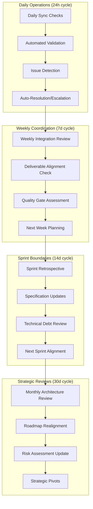
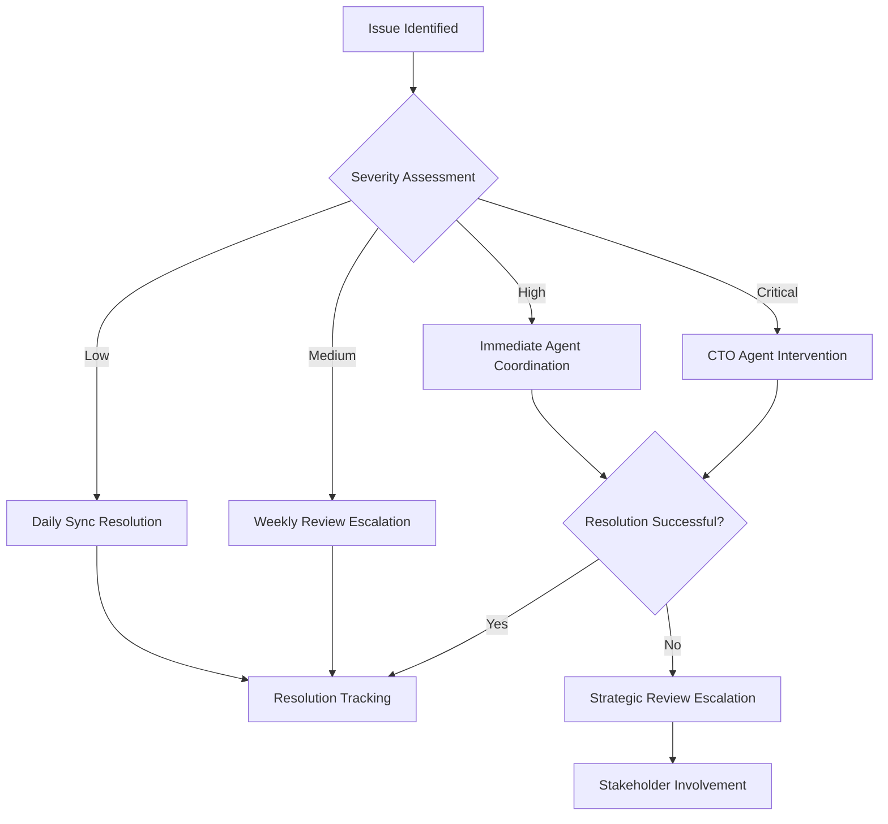
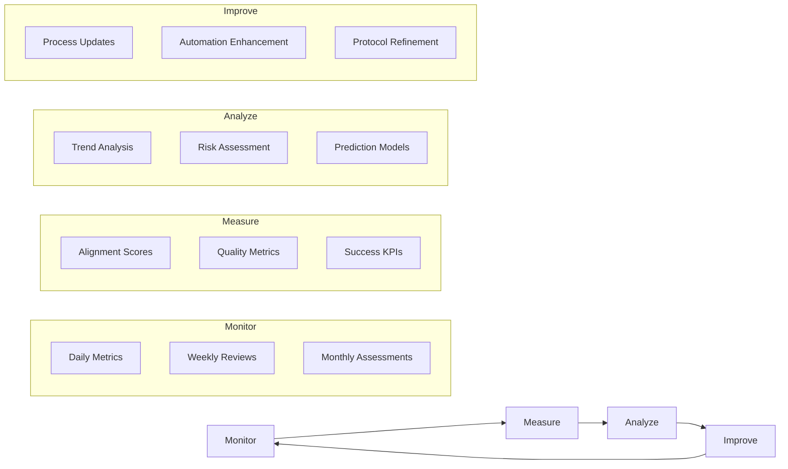

# PRISM Continuous Alignment Framework
## Ongoing Agent Coordination & Synchronization Protocol

**Version:** 1.0.0  
**Date:** 2025-01-20  
**Status:** Active Framework  
**Scope:** Post-Phase 2 continuous coordination for MVP development and beyond

---

## Executive Summary

This framework establishes structured processes to ensure all PRISM agents (CTO, PM, QA) remain continuously aligned throughout development. With Phase 2 integration complete and MVP development beginning, this framework prevents specification drift, maintains quality standards, and ensures coordinated evolution of the system.

### Framework Objectives ✅
- **Prevent Specification Drift**: Maintain consistency between agent deliverables as development progresses
- **Enable Adaptive Planning**: Allow for requirement evolution while maintaining alignment
- **Ensure Quality Gates**: Continuous validation of deliverables against established standards
- **Facilitate Communication**: Clear protocols for cross-agent coordination and decision-making

---

## Alignment Architecture

### Multi-Layer Coordination Model


---

## Daily Synchronization Protocol

### Automated Alignment Checks (Running Continuously)
```yaml
daily_automation:
  specification_validation:
    frequency: "Every 4 hours"
    scope:
      - API specification consistency
      - Testing framework alignment
      - Documentation synchronization
      - Code implementation compliance
    
  quality_metrics:
    frequency: "Every 6 hours"  
    scope:
      - Test coverage maintenance
      - Performance regression detection
      - Security compliance validation
      - Mobile compatibility checks
    
  integration_health:
    frequency: "Every 2 hours"
    scope:
      - Cross-team deliverable compatibility
      - Dependency status monitoring
      - Blocker identification
      - Progress tracking
```

#### Daily Sync Meeting Protocol (15 minutes, 09:00 UTC)
```yaml
daily_sync_agenda:
  time_allocation:
    progress_updates: "5 minutes"
    alignment_validation: "5 minutes" 
    blocker_resolution: "3 minutes"
    next_24h_coordination: "2 minutes"
    
  participants:
    required: ["PM Agent", "QA Agent"]
    optional: ["CTO Agent (as needed)"]
    format: "Structured with automated agenda"
    
  decision_framework:
    minor_issues: "Resolved in meeting"
    technical_conflicts: "Escalated to CTO Agent"
    scope_changes: "Documented and reviewed"
    timeline_impacts: "Risk assessment triggered"
```

#### Automated Issue Detection & Resolution
```typescript
// Continuous Alignment Monitor
class AlignmentMonitor {
  async runDailyChecks(): Promise<AlignmentReport> {
    const checks = [
      this.validateAPISpecConsistency(),
      this.checkTestCoverageAlignment(), 
      this.verifyDocumentationSync(),
      this.validateMobileCompatibility(),
      this.checkEnterpriseCompliance()
    ];
    
    const results = await Promise.all(checks);
    const issues = results.filter(r => !r.passing);
    
    if (issues.length > 0) {
      await this.triggerResolutionWorkflow(issues);
    }
    
    return this.generateAlignmentReport(results);
  }
  
  private async triggerResolutionWorkflow(issues: Issue[]) {
    for (const issue of issues) {
      if (issue.severity === 'critical') {
        await this.escalateToCTO(issue);
      } else if (issue.severity === 'high') {
        await this.notifyRelevantAgents(issue);
      } else {
        await this.scheduleForResolution(issue);
      }
    }
  }
}
```

---

## Weekly Integration Reviews

### Comprehensive Alignment Assessment
**Schedule**: Every Friday, 14:00 UTC (45 minutes)  
**Participants**: PM Agent, QA Agent, CTO Agent (if needed)

#### Week 1-2: MVP Development Focus
```yaml
week1_2_review_focus:
  deliverable_validation:
    api_specifications:
      - OpenAPI 3.0 compliance with implementation
      - Error handling consistency
      - Performance target adherence
      - Security requirement fulfillment
      
    testing_framework:
      - Contract testing operational
      - Unit test coverage >90%
      - Integration test completeness
      - Mobile testing framework readiness
      
    user_experience:
      - 15-minute onboarding validated
      - Error UX patterns implemented
      - Progressive loading functional
      - Mobile responsiveness confirmed
      
  quality_gates:
    - Sprint 1 gate criteria met
    - No critical specification conflicts
    - All automated tests passing
    - Performance benchmarks achieved
```

#### Week 3-4: Enterprise & Mobile Integration
```yaml
week3_4_review_focus:
  enterprise_readiness:
    authentication:
      - SSO integration functional
      - RBAC permissions validated
      - Audit logging operational
      - Policy enforcement tested
      
    compliance:
      - GDPR compliance validated
      - SOC 2 preparation complete
      - Data residency implemented
      - Security audit findings resolved
      
  mobile_optimization:
    p2p_networking:
      - Cross-platform connectivity confirmed
      - Battery optimization implemented
      - NAT traversal solutions tested
      - Offline functionality validated
      
  integration_validation:
    - Cross-platform compatibility
    - Performance under load
    - Enterprise feature completeness
    - Mobile UX patterns implemented
```

### Weekly Deliverable Synchronization
```typescript
// Weekly Alignment Validator
class WeeklyAlignmentValidator {
  async validateWeeklyAlignment(): Promise<WeeklyReport> {
    const validations = {
      specifications: await this.validateSpecificationAlignment(),
      implementations: await this.validateImplementationAlignment(), 
      testing: await this.validateTestingAlignment(),
      documentation: await this.validateDocumentationAlignment()
    };
    
    const alignmentScore = this.calculateAlignmentScore(validations);
    const recommendations = this.generateRecommendations(validations);
    
    return {
      score: alignmentScore,
      validations,
      recommendations,
      nextWeekPriorities: this.prioritizeNextWeek(validations)
    };
  }
  
  private calculateAlignmentScore(validations: ValidationResults): number {
    const weights = {
      specifications: 0.4,
      implementations: 0.3,
      testing: 0.2,
      documentation: 0.1
    };
    
    return Object.entries(validations).reduce((score, [key, result]) => {
      return score + (result.passRate * weights[key]);
    }, 0) * 100;
  }
}
```

---

## Sprint Boundary Alignment

### Sprint Retrospective & Realignment (Every 2 weeks)
**Duration**: 2 hours  
**Format**: Structured retrospective with alignment focus

#### Sprint Retrospective Framework
```yaml
retrospective_structure:
  part_1_reflection: # 45 minutes
    what_worked_well:
      - Agent coordination effectiveness
      - Deliverable quality and timeliness
      - Cross-team collaboration success
      - Technical implementation alignment
      
    what_could_improve:
      - Specification synchronization gaps
      - Communication bottlenecks
      - Quality gate inefficiencies
      - Resource allocation issues
      
    action_items:
      - Process improvements
      - Tool enhancements
      - Communication protocol updates
      - Quality standard adjustments
      
  part_2_realignment: # 60 minutes
    specification_updates:
      - API specification evolution
      - Testing requirement changes
      - Enterprise feature additions
      - Mobile optimization updates
      
    quality_standard_review:
      - Performance benchmark updates
      - Security requirement evolution
      - Compliance standard changes
      - User experience criteria updates
      
  part_3_next_sprint: # 15 minutes
    alignment_priorities:
      - Critical alignment needs
      - New coordination requirements
      - Risk mitigation updates
      - Success criteria definition
```

#### Post-Sprint Specification Sync
```typescript
// Sprint Boundary Synchronization
class SprintBoundarySync {
  async performSprintRealignment(): Promise<RealignmentPlan> {
    // Collect changes from all agents
    const changes = {
      pmChanges: await this.collectPMSpecificationChanges(),
      qaChanges: await this.collectQAFrameworkChanges(),
      ctoChanges: await this.collectArchitecturalChanges()
    };
    
    // Identify conflicts and dependencies
    const conflicts = this.identifyConflicts(changes);
    const dependencies = this.analyzeDependencies(changes);
    
    // Generate realignment plan
    return this.createRealignmentPlan(changes, conflicts, dependencies);
  }
  
  private identifyConflicts(changes: AllChanges): Conflict[] {
    const conflicts: Conflict[] = [];
    
    // API specification conflicts
    if (this.hasAPIConflicts(changes.pmChanges, changes.qaChanges)) {
      conflicts.push({
        type: 'api_specification',
        severity: 'high',
        resolution: 'require_pm_qa_alignment_session'
      });
    }
    
    // Performance requirement conflicts
    if (this.hasPerformanceConflicts(changes)) {
      conflicts.push({
        type: 'performance_requirements',
        severity: 'medium', 
        resolution: 'technical_feasibility_review'
      });
    }
    
    return conflicts;
  }
}
```

---

## Strategic Realignment Reviews

### Monthly Architecture & Strategy Review
**Schedule**: First Monday of each month, 10:00 UTC (2 hours)  
**Participants**: All agents + stakeholders

#### Strategic Review Agenda
```yaml
monthly_strategic_review:
  architecture_evolution: # 30 minutes
    - Core system evolution needs
    - Performance scaling requirements
    - Technology stack updates
    - Security architecture enhancements
    
  market_alignment: # 30 minutes  
    - Competitive landscape changes
    - Customer feedback integration
    - Enterprise requirement evolution
    - Mobile strategy adjustments
    
  roadmap_realignment: # 45 minutes
    - Feature prioritization updates
    - Timeline adjustments
    - Resource allocation review
    - Risk mitigation updates
    
  success_metrics_review: # 15 minutes
    - KPI performance analysis
    - Success criteria updates
    - Measurement framework improvements
    - Reporting enhancement needs
```

#### Strategic Pivot Framework
```typescript
// Strategic Realignment Engine
class StrategicRealignmentEngine {
  async assessStrategicAlignment(): Promise<StrategicAssessment> {
    const assessments = {
      technical: await this.assessTechnicalAlignment(),
      business: await this.assessBusinessAlignment(),
      competitive: await this.assessCompetitivePosition(),
      resource: await this.assessResourceAlignment()
    };
    
    const recommendations = this.generateStrategicRecommendations(assessments);
    const pivotRequirements = this.identifyPivotRequirements(assessments);
    
    return {
      currentAlignment: this.calculateStrategicAlignment(assessments),
      recommendations,
      pivotRequirements,
      implementationPlan: this.createImplementationPlan(recommendations)
    };
  }
  
  private identifyPivotRequirements(assessments: Assessments): PivotRequirement[] {
    const pivots: PivotRequirement[] = [];
    
    if (assessments.competitive.threatLevel === 'high') {
      pivots.push({
        type: 'competitive_response',
        urgency: 'high',
        impactAreas: ['feature_prioritization', 'go_to_market'],
        timeline: '4_weeks'
      });
    }
    
    if (assessments.technical.scalabilityGap > 0.3) {
      pivots.push({
        type: 'architecture_evolution',
        urgency: 'medium',
        impactAreas: ['system_design', 'performance'],
        timeline: '8_weeks'
      });
    }
    
    return pivots;
  }
}
```

---

## Quality Assurance Continuity

### Continuous Quality Gates
```yaml
continuous_quality_framework:
  code_quality:
    frequency: "Every commit"
    gates:
      - Unit test coverage >90%
      - Code quality score >8/10
      - Security vulnerability scan clean
      - Performance regression detection
      
  integration_quality:
    frequency: "Every merge"
    gates:
      - API contract compliance 100%
      - Cross-browser compatibility confirmed
      - Mobile responsiveness validated
      - Accessibility standards met
      
  system_quality:
    frequency: "Daily"
    gates:
      - End-to-end test suite passing
      - Performance benchmarks met
      - Security compliance validated
      - Monitoring alerts clear
      
  release_quality:
    frequency: "Pre-release"
    gates:
      - User acceptance criteria met
      - Load testing passed
      - Security audit approved
      - Documentation complete
```

### Quality Metrics Tracking
```typescript
// Continuous Quality Monitoring
class ContinuousQualityMonitor {
  private readonly qualityMetrics = {
    codeQuality: new CodeQualityTracker(),
    testCoverage: new TestCoverageTracker(), 
    performance: new PerformanceTracker(),
    security: new SecurityTracker(),
    userExperience: new UXMetricsTracker()
  };
  
  async generateQualityReport(): Promise<QualityReport> {
    const metrics = await Promise.all([
      this.qualityMetrics.codeQuality.getCurrentMetrics(),
      this.qualityMetrics.testCoverage.getCoverageReport(),
      this.qualityMetrics.performance.getPerformanceReport(),
      this.qualityMetrics.security.getSecurityReport(),
      this.qualityMetrics.userExperience.getUXReport()
    ]);
    
    const trends = this.analyzeTrends(metrics);
    const predictions = this.predictQualityTrajectory(trends);
    const recommendations = this.generateQualityRecommendations(metrics, trends);
    
    return {
      currentMetrics: metrics,
      trends,
      predictions,
      recommendations,
      riskAreas: this.identifyRiskAreas(metrics, trends)
    };
  }
}
```

---

## Communication & Escalation Protocols

### Communication Matrix
```yaml
communication_protocols:
  daily_operations:
    channels: ["Slack #prism-alignment", "Daily sync meetings"]
    response_time: "4 hours"
    escalation_threshold: "24 hours no response"
    
  weekly_coordination:
    channels: ["Weekly review meetings", "Email summaries"]
    response_time: "24 hours"
    escalation_threshold: "72 hours no response"
    
  critical_issues:
    channels: ["Immediate Slack ping", "Emergency call"]
    response_time: "1 hour"
    escalation_threshold: "4 hours no resolution"
    
  strategic_decisions:
    channels: ["Monthly review meetings", "Decision documents"]
    response_time: "48 hours"
    escalation_threshold: "1 week no consensus"
```

### Escalation Ladder


---

## Risk Management & Mitigation

### Continuous Risk Assessment
```yaml
risk_monitoring:
  technical_risks:
    specification_drift:
      indicators: ["API inconsistencies", "Test failures", "Documentation gaps"]
      mitigation: ["Automated validation", "Daily sync", "Version control"]
      
    performance_degradation:
      indicators: ["Response time increase", "Throughput decrease", "Error rate rise"]
      mitigation: ["Performance monitoring", "Load testing", "Optimization sprints"]
      
    security_vulnerabilities:
      indicators: ["Security scan failures", "Audit findings", "Compliance gaps"]
      mitigation: ["Security automation", "Regular audits", "Compliance testing"]
      
  coordination_risks:
    communication_breakdown:
      indicators: ["Missed meetings", "Delayed responses", "Misaligned deliverables"]
      mitigation: ["Escalation protocols", "Backup communication", "Documentation standards"]
      
    resource_constraints:
      indicators: ["Timeline delays", "Quality degradation", "Scope reduction"]
      mitigation: ["Resource monitoring", "Capacity planning", "Priority adjustment"]
```

### Predictive Risk Modeling
```typescript
// Risk Prediction Engine
class RiskPredictionEngine {
  async predictRisks(): Promise<RiskPrediction[]> {
    const historicalData = await this.getHistoricalRiskData();
    const currentIndicators = await this.getCurrentRiskIndicators();
    
    const riskModels = {
      specificationDrift: this.buildSpecDriftModel(historicalData),
      qualityDegradation: this.buildQualityModel(historicalData),
      timelineSlippage: this.buildTimelineModel(historicalData),
      communicationBreakdown: this.buildCommunicationModel(historicalData)
    };
    
    return Object.entries(riskModels).map(([riskType, model]) => {
      const probability = model.predict(currentIndicators);
      const impact = this.assessRiskImpact(riskType, currentIndicators);
      
      return {
        type: riskType,
        probability,
        impact,
        severity: probability * impact,
        mitigationActions: this.recommendMitigationActions(riskType, probability, impact)
      };
    });
  }
}
```

---

## Success Metrics & KPIs

### Alignment Quality Metrics
```yaml
alignment_kpis:
  specification_consistency:
    metric: "Percentage of specifications in sync"
    target: ">95%"
    measurement: "Automated daily validation"
    
  deliverable_alignment:
    metric: "Cross-agent deliverable compatibility score"
    target: ">90%"
    measurement: "Weekly integration assessment"
    
  communication_effectiveness:
    metric: "Average issue resolution time"
    target: "<48 hours"
    measurement: "Issue tracking system"
    
  quality_gate_performance:
    metric: "Percentage of quality gates passed on first attempt"
    target: ">85%"
    measurement: "CI/CD pipeline metrics"
```

### Predictive Success Indicators
```typescript
// Success Prediction Dashboard
class SuccessPredictionDashboard {
  async generateSuccessPrediction(): Promise<SuccessPrediction> {
    const metrics = {
      alignmentTrend: await this.getAlignmentTrend(),
      qualityTrend: await this.getQualityTrend(),
      velocityTrend: await this.getVelocityTrend(),
      riskTrend: await this.getRiskTrend()
    };
    
    const successProbability = this.calculateSuccessProbability(metrics);
    const timelinePrediction = this.predictTimelineCompletion(metrics);
    const qualityPrediction = this.predictQualityOutcome(metrics);
    
    return {
      overallSuccessProbability: successProbability,
      timelinePrediction,
      qualityPrediction,
      riskFactors: this.identifyRiskFactors(metrics),
      recommendations: this.generateSuccessRecommendations(metrics)
    };
  }
}
```

---

## Implementation & Activation

### Framework Activation Checklist
```yaml
activation_steps:
  week_1:
    - [ ] Deploy automated alignment monitoring
    - [ ] Establish daily sync meeting schedule
    - [ ] Configure quality gate automation
    - [ ] Set up communication channels
    
  week_2:
    - [ ] Conduct first weekly integration review
    - [ ] Test escalation procedures
    - [ ] Validate risk monitoring systems
    - [ ] Train team on protocols
    
  week_3:
    - [ ] Refine processes based on feedback
    - [ ] Optimize automation systems
    - [ ] Establish baseline metrics
    - [ ] Document lessons learned
    
  week_4:
    - [ ] Conduct first monthly strategic review
    - [ ] Evaluate framework effectiveness
    - [ ] Plan framework evolution
    - [ ] Communicate success metrics
```

### Continuous Improvement Loop


---

## Conclusion

This Continuous Alignment Framework ensures that all PRISM agents remain synchronized and coordinated throughout the development lifecycle and beyond. The multi-layered approach provides:

✅ **Real-time Alignment**: Daily automated checks and sync meetings  
✅ **Quality Assurance**: Continuous validation and quality gates  
✅ **Risk Management**: Proactive risk identification and mitigation  
✅ **Strategic Alignment**: Regular strategic reviews and realignment  
✅ **Predictive Intelligence**: Advanced analytics for success prediction

### Framework Benefits
- **Prevents Specification Drift**: Automated validation ensures consistency
- **Enables Rapid Response**: Quick identification and resolution of issues
- **Maintains Quality Standards**: Continuous quality gates and monitoring
- **Facilitates Evolution**: Structured processes for requirement changes
- **Ensures Success**: Predictive analytics and success optimization

The framework is designed to evolve with the project, incorporating lessons learned and adapting to changing requirements while maintaining the core objective of seamless agent coordination.

---

*This framework establishes the foundation for continuous excellence in multi-agent coordination, ensuring PRISM delivers on its promise of seamless distributed development capabilities.*