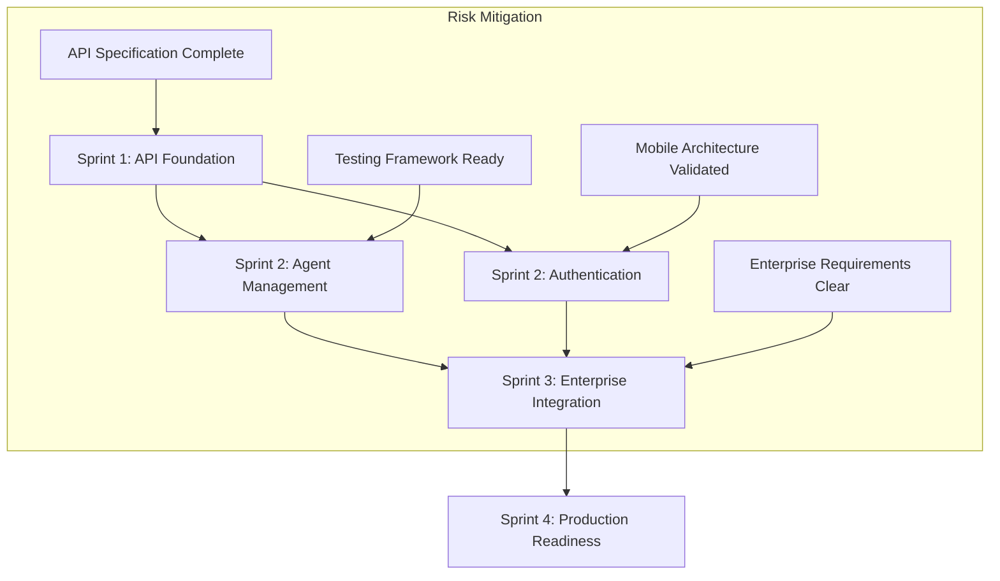

# PRISM Implementation Guide
## Coordinated Development Execution Plan

**Version:** 1.0.0  
**Date:** 2025-01-20  
**Status:** Ready for MVP Development  
**Scope:** End-to-end implementation coordination based on completed Phase 2 agent deliverables

---

## Executive Summary

This implementation guide provides the definitive roadmap for PRISM MVP development, coordinating all deliverables from PM Agent, QA Agent, and technical validation efforts. All specifications are complete and implementation-ready.

### Implementation Readiness Status ✅
- **Phase 2 Integration**: Complete with all agent deliverables validated
- **Technical Architecture**: Validated and implementation-ready
- **API Specifications**: Complete OpenAPI 3.0 with contract testing
- **Mobile Strategy**: Technically validated with implementation plan
- **Enterprise Integration**: Specifications complete with compliance framework
- **Testing Framework**: Comprehensive automation ready for CI/CD

---

## Development Team Structure & Responsibilities

### Core Platform Team (8 engineers)
```yaml
team_structure:
  tech_lead:
    role: "Technical Leadership & Architecture"
    focus: ["API design", "system integration", "performance optimization"]
    
  backend_engineers:
    count: 4
    responsibilities:
      - "REST API implementation (OpenAPI spec)"
      - "Agent swarm orchestration"
      - "P2P networking integration"
      - "Enterprise authentication & authorization"
    deliverables:
      - "API endpoints with contract testing"
      - "Agent lifecycle management"
      - "Real-time WebSocket events"
      - "Enterprise SSO integration"
      
  frontend_engineers:
    count: 2
    responsibilities:
      - "Web dashboard implementation"
      - "Agent monitoring interfaces"
      - "Error handling UX patterns"
      - "Progressive loading optimization"
    deliverables:
      - "React dashboard with real-time updates"
      - "Agent deployment wizard"
      - "System health monitoring UI"
      - "Mobile-responsive interface"
      
  devops_engineer:
    role: "Infrastructure & Deployment"
    responsibilities:
      - "CI/CD pipeline with quality gates"
      - "Testing automation integration"
      - "Performance monitoring setup"
      - "Enterprise deployment scripts"
    deliverables:
      - "Automated testing pipeline"
      - "Performance regression detection"
      - "Docker & Kubernetes configurations"
      - "Monitoring & alerting systems"
      
  qa_engineer:
    role: "Quality Assurance & Testing"
    responsibilities:
      - "Contract testing implementation"
      - "Mobile testing framework"
      - "Compliance testing automation"
      - "Performance validation"
    deliverables:
      - "Automated test suites (90% coverage)"
      - "Mobile P2P testing framework"
      - "Enterprise compliance validation"
      - "Load testing infrastructure"
```

---

## Sprint-by-Sprint Implementation Plan

### Sprint 1 (2 weeks): Foundation & API Implementation

#### Backend Team Priorities
**Primary**: REST API implementation based on OpenAPI specification
```typescript
// Sprint 1 Backend Deliverables
const sprint1Backend = {
  api_endpoints: {
    agents: {
      'POST /api/v1/agents': 'Agent creation with validation',
      'GET /api/v1/agents': 'Agent listing with filtering',
      'GET /api/v1/agents/{id}': 'Agent details with metrics',
      'PUT /api/v1/agents/{id}/config': 'Agent configuration updates',
      'DELETE /api/v1/agents/{id}': 'Agent lifecycle termination'
    },
    system: {
      'GET /api/v1/system/health': 'System health endpoints',
      'GET /api/v1/system/metrics': 'Performance metrics API',
      'WS /api/v1/events': 'Real-time event streaming'
    }
  },
  
  testing: {
    contract_tests: 'OpenAPI specification validation',
    unit_tests: '>80% code coverage target',
    integration_tests: 'Database & external service testing'
  },
  
  performance: {
    response_time: '<100ms for 95% of requests',
    concurrent_users: 'Support 100+ concurrent connections',
    error_handling: 'User-friendly error responses'
  }
};
```

#### Frontend Team Priorities
**Primary**: Core dashboard and agent management interface
```typescript
// Sprint 1 Frontend Deliverables
const sprint1Frontend = {
  components: {
    AgentDashboard: 'Main agent overview with real-time status',
    AgentCard: 'Individual agent display with metrics',
    SystemHealth: 'System-wide health indicators',
    ErrorBoundary: 'User-friendly error handling'
  },
  
  features: {
    real_time_updates: 'WebSocket integration for live data',
    progressive_loading: 'Optimized data loading patterns',
    responsive_design: 'Mobile-responsive interface',
    error_handling: 'Error recovery and user feedback'
  },
  
  testing: {
    component_tests: 'React Testing Library coverage',
    e2e_tests: 'Critical user journey validation',
    accessibility: 'WCAG 2.1 compliance'
  }
};
```

### Sprint 2 (2 weeks): Agent Management & Authentication

#### Backend Team Focus
**Primary**: Agent lifecycle management and authentication
```yaml
sprint2_backend:
  agent_management:
    - Agent deployment with resource validation
    - Agent health monitoring and recovery
    - Task assignment and queue management
    - Agent capability discovery
    
  authentication:
    - JWT token-based authentication
    - Role-based access control (RBAC)
    - Session management and refresh
    - Basic enterprise SSO preparation
    
  testing:
    - RBAC permission matrix testing
    - Agent deployment flow validation
    - Authentication security testing
    - Performance under concurrent load
```

#### Frontend Team Focus
**Primary**: Agent deployment and task management
```yaml
sprint2_frontend:
  deployment_wizard:
    - Step-by-step agent configuration
    - Resource requirement validation
    - Real-time deployment progress
    - Error recovery and retry logic
    
  task_management:
    - Task queue visualization
    - Task assignment interface
    - Progress tracking and updates
    - Task history and logging
    
  authentication_ui:
    - Login/logout interface
    - Session timeout handling
    - Role-based feature access
    - User profile management
```

### Sprint 3 (2 weeks): Enterprise Integration & Mobile Preparation

#### Backend Team Focus
**Primary**: Enterprise features and mobile API optimization
```yaml
sprint3_backend:
  enterprise_integration:
    - SSO provider integration (SAML, OAuth)
    - Enterprise policy engine implementation
    - Audit logging and compliance tracking
    - Data residency and encryption
    
  mobile_optimization:
    - API response optimization for mobile
    - P2P networking mobile adaptations
    - Battery-aware performance scaling
    - Offline queue management
    
  testing:
    - Enterprise compliance validation
    - Mobile API performance testing
    - Security penetration testing
    - Audit logging verification
```

#### Frontend Team Focus
**Primary**: Advanced dashboard features and mobile preparation
```yaml
sprint3_frontend:
  advanced_features:
    - Multi-agent coordination dashboard
    - Advanced filtering and search
    - Data export and reporting
    - Customizable dashboard layouts
    
  mobile_preparation:
    - Mobile-responsive optimizations
    - Touch gesture handling
    - Offline state management
    - Progressive web app features
    
  enterprise_ui:
    - Admin configuration interfaces
    - Policy management dashboard
    - Audit log visualization
    - Compliance reporting
```

### Sprint 4 (2 weeks): Testing, Performance & Polish

#### All Team Coordination
**Primary**: Quality assurance, performance optimization, and production readiness
```yaml
sprint4_coordination:
  quality_assurance:
    - Comprehensive E2E testing
    - Performance regression testing
    - Security vulnerability scanning
    - Accessibility compliance validation
    
  performance_optimization:
    - API response time optimization
    - Frontend bundle size reduction
    - Database query optimization
    - Memory usage optimization
    
  production_readiness:
    - Docker containerization
    - Kubernetes deployment configuration
    - Monitoring and alerting setup
    - Documentation completion
```

---

## Quality Gates & Success Criteria

### Sprint Quality Gates
Each sprint must pass these quality gates before proceeding:

#### Sprint 1 Gate
```yaml
api_functionality:
  - All core API endpoints operational
  - OpenAPI specification compliance: 100%
  - Unit test coverage: >80%
  - Response time: <100ms for 95% requests

ui_functionality:
  - Agent dashboard displays real-time data
  - System health monitoring functional
  - Error handling tested and validated
  - Mobile responsive design confirmed
```

#### Sprint 2 Gate
```yaml
agent_management:
  - Agent deployment wizard operational
  - Agent lifecycle management complete
  - Task assignment and tracking functional
  - Authentication system secure and tested

user_experience:
  - 15-minute onboarding target achieved
  - Error recovery flows validated
  - Real-time updates working reliably
  - RBAC access control enforced
```

#### Sprint 3 Gate
```yaml
enterprise_readiness:
  - SSO integration functional
  - Policy enforcement operational
  - Audit logging comprehensive
  - Compliance testing passed

mobile_readiness:
  - Mobile API performance optimized
  - P2P networking mobile-compatible
  - Battery optimization implemented
  - Offline functionality validated
```

#### Sprint 4 Gate
```yaml
production_readiness:
  - E2E test suite: >90% user journey coverage
  - Performance benchmarks met
  - Security vulnerabilities: Zero critical
  - Documentation complete and reviewed
```

---

## Integration Testing Strategy

### Continuous Integration Pipeline
```yaml
ci_pipeline:
  commit_stage:
    - Unit tests execution (>90% coverage required)
    - Code quality checks (linting, formatting)
    - Security scanning (SAST)
    - Contract testing validation
    
  integration_stage:
    - API integration tests
    - Database migration tests
    - Third-party service mocking
    - Performance regression detection
    
  acceptance_stage:
    - E2E user journey tests
    - Browser compatibility testing
    - Mobile responsiveness validation
    - Accessibility compliance checks
    
  deployment_stage:
    - Docker image building
    - Kubernetes deployment testing
    - Health check validation
    - Production monitoring setup
```

### Testing Framework Coordination
Based on QA Agent deliverables:

#### Contract Testing (Daily)
```typescript
// Automated contract validation
describe('API Contract Compliance', () => {
  test('All endpoints match OpenAPI specification', async () => {
    const spec = await loadOpenAPISpec();
    const endpoints = await discoverAPIEndpoints();
    
    for (const endpoint of endpoints) {
      await validateEndpointContract(endpoint, spec);
    }
  });
});
```

#### Mobile P2P Testing (Weekly)
```typescript
// Multi-device P2P connectivity
describe('Mobile P2P Integration', () => {
  test('Cross-platform connectivity', async () => {
    const devices = await setupTestDevices(['iOS 16', 'Android 13']);
    const connectionResults = await testP2PConnectivity(devices);
    
    expect(connectionResults.successRate).toBeGreaterThan(0.95);
    expect(connectionResults.averageLatency).toBeLessThan(200);
  });
});
```

#### Compliance Testing (Pre-release)
```typescript
// Enterprise compliance validation
describe('Enterprise Compliance', () => {
  test('GDPR compliance validation', async () => {
    const complianceResults = await runGDPRTests();
    expect(complianceResults.violations).toHaveLength(0);
  });
});
```

---

## Risk Management & Mitigation

### Critical Path Dependencies


### Risk Mitigation Strategies
```yaml
technical_risks:
  api_performance:
    risk: "API response times exceed targets"
    probability: "Medium"
    impact: "High"
    mitigation: 
      - "Implement aggressive caching strategy"
      - "Database query optimization"
      - "CDN for static assets"
    
  mobile_p2p:
    risk: "P2P connectivity unreliable on mobile"
    probability: "Low"
    impact: "High" 
    mitigation:
      - "Fallback relay server implementation"
      - "Progressive connectivity degradation"
      - "Comprehensive NAT traversal testing"
    
  enterprise_certification:
    risk: "Compliance certification delays"
    probability: "Medium"
    impact: "Medium"
    mitigation:
      - "Early SOC 2 audit initiation"
      - "Continuous compliance testing"
      - "External security assessment"

business_risks:
  timeline_slippage:
    risk: "Sprint deadlines missed"
    probability: "Medium"
    impact: "High"
    mitigation:
      - "Daily progress tracking"
      - "Buffer time in critical path"
      - "Scope reduction priorities defined"
      
  team_coordination:
    risk: "Cross-team integration issues"
    probability: "Low"
    impact: "Medium"
    mitigation:
      - "Daily standup coordination"
      - "Integration checkpoints"
      - "Shared documentation standards"
```

---

## Success Metrics & Monitoring

### Development Velocity Metrics
```yaml
velocity_tracking:
  sprint_metrics:
    - Story points completed per sprint
    - Velocity trend analysis
    - Sprint goal achievement rate
    - Technical debt accumulation
    
  quality_metrics:
    - Test coverage percentage
    - Bug discovery rate
    - Performance regression incidents
    - Code review feedback cycles
    
  integration_metrics:
    - Cross-team collaboration effectiveness
    - Dependency blocking incidents
    - Documentation completeness
    - Stakeholder satisfaction scores
```

### Production Readiness Indicators
```yaml
readiness_metrics:
  performance:
    - API response time: <100ms (95th percentile)
    - UI load time: <3 seconds
    - System throughput: >1000 concurrent users
    - Error rate: <0.1%
    
  reliability:
    - System uptime: >99.9%
    - Data consistency: 100%
    - Backup/recovery: <30 minutes
    - Security incidents: Zero
    
  user_experience:
    - Onboarding completion rate: >90%
    - User satisfaction score: >4.5/5
    - Support ticket rate: <2%
    - Feature adoption rate: >80%
```

---

## Deployment Strategy

### Production Deployment Pipeline
```yaml
deployment_stages:
  development:
    environment: "Local development"
    purpose: "Feature development and unit testing"
    deployment: "Manual developer deployments"
    
  staging:
    environment: "Staging cluster"
    purpose: "Integration testing and QA validation"
    deployment: "Automated on merge to develop"
    
  production:
    environment: "Production cluster"
    purpose: "Live user traffic"
    deployment: "Blue-green with canary releases"
    
rollout_strategy:
  week_1: "Internal team testing (50 users)"
  week_2: "Beta customer group (500 users)"
  week_3: "Gradual rollout (5,000 users)"
  week_4: "Full production release"
```

### Monitoring & Observability
```yaml
monitoring_setup:
  application_metrics:
    - Response time percentiles
    - Error rate tracking
    - User session analytics
    - Feature usage statistics
    
  infrastructure_metrics:
    - CPU and memory utilization
    - Database performance
    - Network latency
    - Storage capacity
    
  business_metrics:
    - User onboarding funnel
    - Agent deployment success rate
    - Enterprise feature adoption
    - Customer satisfaction scores
```

---

## Documentation & Knowledge Transfer

### Technical Documentation Requirements
```yaml
documentation_deliverables:
  api_documentation:
    - OpenAPI 3.0 specification with examples
    - SDK documentation and tutorials
    - Authentication and authorization guides
    - Rate limiting and error handling
    
  deployment_documentation:
    - Installation and setup guides
    - Configuration management
    - Monitoring and troubleshooting
    - Backup and recovery procedures
    
  developer_documentation:
    - Architecture decision records
    - Code contribution guidelines
    - Testing best practices
    - Performance optimization guides
```

### User Documentation
```yaml
user_guides:
  getting_started:
    - 15-minute quick start tutorial
    - Agent deployment walkthrough
    - Common troubleshooting scenarios
    - Best practices and tips
    
  advanced_features:
    - Enterprise integration setup
    - Mobile app configuration
    - Multi-agent orchestration
    - Performance optimization
    
  admin_guides:
    - User management and permissions
    - Policy configuration
    - Audit logging and compliance
    - System monitoring and alerts
```

---

## Conclusion

This implementation guide provides a comprehensive roadmap for PRISM MVP development, built upon the solid foundation of completed Phase 2 agent deliverables. The coordinated approach ensures:

✅ **Clear Development Path**: Sprint-by-sprint roadmap with defined deliverables  
✅ **Quality Assurance**: Comprehensive testing framework with automation  
✅ **Risk Mitigation**: Proactive risk management with contingency plans  
✅ **Team Coordination**: Structured collaboration across all development teams  
✅ **Production Readiness**: End-to-end deployment and monitoring strategy  

### Next Steps
1. **Team Assembly**: Recruit and onboard development team members
2. **Sprint Planning**: Detailed story breakdown and task assignment
3. **Environment Setup**: Development, staging, and production infrastructure
4. **Kickoff Meeting**: Align all teams on goals, timelines, and success criteria

The implementation is ready to begin with confidence in achieving the 8-week MVP delivery timeline.

---

*This implementation guide serves as the definitive execution plan, coordinating all agent deliverables into a cohesive development strategy that delivers enterprise-ready PRISM capabilities.*