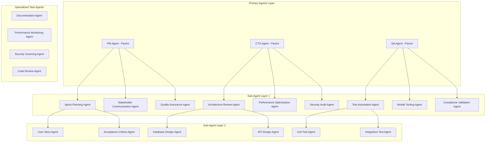

# PRISM Sub-Agent Spawning Framework
## Enterprise-Level Dynamic Agent Creation & Management System

**Version**: 1.0.0  
**Date**: January 21, 2025  
**Status**: Architecture Design - Ready for Implementation  
**Scope**: Multi-agent coordination with dynamic sub-agent spawning capabilities  

---

## Executive Summary

The PRISM Sub-Agent Spawning Framework enables the Product Manager Agent (and other primary agents) to dynamically create specialized sub-agents for complex, multi-faceted tasks. This system provides enterprise-level scalability by distributing work across purpose-built agents while maintaining coordination and quality standards.

### Key Capabilities
- **Dynamic Agent Creation**: Spawn specialized sub-agents based on task requirements
- **Hierarchical Management**: Parent-child agent relationships with delegation chains
- **Resource Management**: Intelligent resource allocation and load balancing
- **Quality Inheritance**: Sub-agents inherit parent quality standards and protocols
- **Enterprise Integration**: Role-based access control and audit trail compliance

---

## Architecture Overview

### Agent Hierarchy Model



### Sub-Agent Classification System

```yaml
agent_types:
  functional_specialists:
    - sprint_planner: "Break down epics into stories with estimates"
    - user_story_writer: "Create detailed user stories with acceptance criteria"
    - acceptance_tester: "Validate story completion against criteria"
    - stakeholder_communicator: "Handle stakeholder updates and reporting"
    
  technical_specialists:
    - api_designer: "Design and validate API specifications"
    - database_architect: "Design schema and optimization"
    - security_auditor: "Security scanning and compliance validation"
    - performance_optimizer: "Performance testing and optimization"
    
  quality_assurance:
    - test_generator: "Generate comprehensive test suites"
    - compliance_validator: "Enterprise compliance testing"
    - mobile_tester: "Cross-platform mobile testing"
    - accessibility_auditor: "WCAG compliance validation"
    
  integration_coordinators:
    - cross_team_coordinator: "Manage dependencies between teams"
    - deployment_manager: "Orchestrate deployment pipelines"
    - monitoring_agent: "Real-time system monitoring and alerting"
    - documentation_manager: "Maintain comprehensive documentation"
```

---

## Sub-Agent Spawning Protocol

### Dynamic Creation Framework

#### Agent Spawning Request Schema
```typescript
interface AgentSpawnRequest {
  parent_agent_id: string;
  agent_type: AgentSpecialization;
  task_specification: {
    title: string;
    description: string;
    acceptance_criteria: string[];
    deadline: Date;
    priority: 'low' | 'medium' | 'high' | 'critical';
  };
  resource_requirements: {
    cpu_cores: number;
    memory_gb: number;
    storage_gb: number;
    max_execution_time: number; // milliseconds
  };
  capabilities_required: string[];
  context_inheritance: {
    inherit_parent_config: boolean;
    inherit_quality_gates: boolean;
    inherit_communication_protocols: boolean;
    custom_overrides: Record<string, any>;
  };
  coordination_requirements: {
    requires_parent_approval: boolean;
    progress_reporting_interval: number; // seconds
    collaboration_agents: string[];
    escalation_triggers: string[];
  };
}
```

#### Implementation Example
```rust
// Sub-agent spawning system in Rust
use tokio::spawn;
use uuid::Uuid;

pub struct SubAgentSpawner {
    agent_registry: HashMap<Uuid, AgentInfo>,
    resource_manager: ResourceManager,
    quality_gate_enforcer: QualityGateEnforcer,
    communication_hub: CommunicationHub,
}

impl SubAgentSpawner {
    pub async fn spawn_sub_agent(
        &mut self,
        request: AgentSpawnRequest,
    ) -> Result<Uuid, SpawnError> {
        // 1. Validate parent agent authorization
        self.validate_parent_authorization(&request.parent_agent_id)?;
        
        // 2. Check resource availability
        self.resource_manager.check_availability(&request.resource_requirements)?;
        
        // 3. Create agent configuration
        let agent_config = self.create_agent_config(&request).await?;
        
        // 4. Initialize sub-agent with inherited context
        let sub_agent_id = Uuid::new_v4();
        let sub_agent = SubAgent::new(
            sub_agent_id,
            agent_config,
            self.inherit_parent_context(&request),
        ).await?;
        
        // 5. Register agent in hierarchy
        self.register_agent_hierarchy(
            &request.parent_agent_id,
            &sub_agent_id,
            &request.agent_type,
        ).await?;
        
        // 6. Start agent execution
        let agent_handle = spawn(async move {
            sub_agent.execute().await
        });
        
        // 7. Set up monitoring and communication
        self.setup_monitoring(&sub_agent_id, &request).await?;
        
        Ok(sub_agent_id)
    }
}
```

### Intelligent Task Decomposition

#### Task Analysis Engine
```typescript
class TaskDecompositionEngine {
  async analyzeTask(task: ComplexTask): Promise<SubTaskPlan> {
    const analysis = {
      complexity: await this.assessComplexity(task),
      dependencies: await this.identifyDependencies(task),
      skillsRequired: await this.extractRequiredSkills(task),
      estimatedEffort: await this.estimateEffort(task),
      parallelizationOpportunities: await this.identifyParallelWork(task)
    };
    
    return this.generateSubTaskPlan(analysis);
  }
  
  private async generateSubTaskPlan(analysis: TaskAnalysis): Promise<SubTaskPlan> {
    const subTasks = [];
    
    // Sequential tasks that must be completed in order
    if (analysis.dependencies.length > 0) {
      subTasks.push(...this.createSequentialTasks(analysis));
    }
    
    // Parallel tasks that can be executed simultaneously
    if (analysis.parallelizationOpportunities.length > 0) {
      subTasks.push(...this.createParallelTasks(analysis));
    }
    
    // Specialized tasks requiring specific expertise
    for (const skill of analysis.skillsRequired) {
      subTasks.push(this.createSpecializedTask(skill, analysis));
    }
    
    return {
      subTasks,
      executionStrategy: this.determineExecutionStrategy(analysis),
      coordinationRequirements: this.defineCoordinationNeeds(analysis),
      qualityGates: this.inheritQualityGates(analysis),
      successCriteria: this.defineSuccessCriteria(analysis)
    };
  }
}
```

---

## Enterprise Agent Specializations

### Sprint Management Agents

#### Sprint Planning Agent
```yaml
sprint_planning_agent:
  specialization: "Epic breakdown and sprint planning"
  capabilities:
    - epic_decomposition: "Break epics into manageable user stories"
    - effort_estimation: "T-shirt sizing and story point estimation"
    - velocity_calculation: "Historical velocity analysis and forecasting"
    - dependency_mapping: "Cross-story and cross-team dependency analysis"
    - sprint_optimization: "Optimal story arrangement for sprint goals"
    
  spawning_triggers:
    - new_epic_created: "Automatically spawn when new epic is added"
    - sprint_planning_scheduled: "Spawn 48 hours before sprint planning"
    - velocity_recalculation_needed: "Spawn when team velocity changes"
    
  success_criteria:
    - story_breakdown_completeness: ">95% of epic scope covered"
    - estimation_accuracy: "Within 20% of actual completion time"
    - dependency_identification: "100% critical dependencies mapped"
    - sprint_goal_alignment: "All stories align with sprint objective"
```

**Implementation**:
```typescript
class SprintPlanningAgent extends SubAgent {
  async executeTask(): Promise<SprintPlan> {
    // 1. Analyze epic requirements
    const epicAnalysis = await this.analyzeEpic(this.task.epic);
    
    // 2. Break down into user stories
    const userStories = await this.generateUserStories(epicAnalysis);
    
    // 3. Estimate effort for each story
    const estimatedStories = await this.estimateEffort(userStories);
    
    // 4. Identify dependencies
    const dependencyMap = await this.mapDependencies(estimatedStories);
    
    // 5. Optimize sprint allocation
    const sprintPlan = await this.optimizeSprintAllocation({
      stories: estimatedStories,
      dependencies: dependencyMap,
      teamVelocity: await this.getTeamVelocity(),
      sprintCapacity: this.task.sprintCapacity
    });
    
    // 6. Validate against sprint goals
    await this.validateSprintAlignment(sprintPlan);
    
    return sprintPlan;
  }
}
```

#### Stakeholder Communication Agent
```yaml
stakeholder_communication_agent:
  specialization: "Automated stakeholder updates and reporting"
  capabilities:
    - progress_synthesis: "Aggregate progress from multiple sources"
    - stakeholder_segmentation: "Tailor communication to audience needs"
    - risk_communication: "Proactive risk and blocker communication"
    - success_metrics_reporting: "Automated KPI dashboard generation"
    - escalation_management: "Intelligent escalation based on severity"
    
  communication_channels:
    - executive_summary: "Weekly high-level progress reports"
    - technical_updates: "Detailed technical progress for engineering"
    - customer_facing: "Customer-ready progress updates"
    - investor_relations: "Investment milestone tracking and reporting"
```

### Technical Architecture Agents

#### API Design Agent
```yaml
api_design_agent:
  specialization: "RESTful API design and OpenAPI specification"
  capabilities:
    - endpoint_design: "Design REST endpoints following best practices"
    - schema_validation: "Generate and validate JSON schemas"
    - documentation_generation: "Auto-generate comprehensive API docs"
    - versioning_strategy: "API versioning and backward compatibility"
    - security_integration: "Authentication and authorization patterns"
    
  quality_standards:
    - openapi_compliance: "100% OpenAPI 3.0 specification compliance"
    - response_time_targets: "<100ms for 95% of endpoints"
    - error_handling: "Consistent error response format across all endpoints"
    - security_standards: "OWASP API security top 10 compliance"
```

**Implementation**:
```rust
pub struct ApiDesignAgent {
    openapi_generator: OpenAPIGenerator,
    security_analyzer: SecurityAnalyzer,
    performance_predictor: PerformancePredictor,
}

impl ApiDesignAgent {
    pub async fn design_api(&self, requirements: ApiRequirements) -> Result<ApiDesign, Error> {
        // 1. Analyze business requirements
        let domain_analysis = self.analyze_domain(&requirements).await?;
        
        // 2. Design endpoint structure
        let endpoints = self.design_endpoints(&domain_analysis).await?;
        
        // 3. Generate OpenAPI specification
        let openapi_spec = self.openapi_generator.generate(&endpoints).await?;
        
        // 4. Validate security requirements
        let security_analysis = self.security_analyzer.analyze(&openapi_spec).await?;
        
        // 5. Predict performance characteristics
        let performance_analysis = self.performance_predictor.analyze(&endpoints).await?;
        
        // 6. Generate comprehensive documentation
        let documentation = self.generate_documentation(&openapi_spec).await?;
        
        Ok(ApiDesign {
            openapi_spec,
            endpoints,
            security_analysis,
            performance_analysis,
            documentation,
        })
    }
}
```

### Quality Assurance Agents

#### Compliance Validation Agent
```yaml
compliance_validation_agent:
  specialization: "Enterprise compliance and regulatory validation"
  capabilities:
    - gdpr_compliance: "GDPR compliance validation and reporting"
    - sox_compliance: "Sarbanes-Oxley compliance for financial controls"
    - hipaa_compliance: "HIPAA compliance for healthcare data"
    - pci_compliance: "PCI DSS compliance for payment processing"
    - iso27001_compliance: "ISO 27001 information security management"
    
  validation_methods:
    - automated_scanning: "Continuous compliance monitoring"
    - manual_auditing: "Human review of critical compliance points"
    - policy_enforcement: "Automated policy violation detection"
    - remediation_suggestions: "Actionable compliance improvement recommendations"
    
  reporting_capabilities:
    - compliance_dashboard: "Real-time compliance status visualization"
    - audit_trail_generation: "Comprehensive audit trail documentation"
    - violation_tracking: "Track and manage compliance violations"
    - remediation_tracking: "Monitor compliance improvement progress"
```

---

## Resource Management & Load Balancing

### Intelligent Resource Allocation

#### Resource Pool Management
```typescript
class ResourcePoolManager {
  private resourcePools: Map<ResourceType, ResourcePool>;
  private allocationStrategy: AllocationStrategy;
  
  async allocateResources(
    request: ResourceRequest,
    priority: Priority
  ): Promise<ResourceAllocation> {
    // 1. Assess current resource utilization
    const utilization = await this.assessUtilization();
    
    // 2. Calculate optimal allocation strategy
    const strategy = await this.calculateAllocationStrategy(request, utilization);
    
    // 3. Reserve resources for the agent
    const allocation = await this.reserveResources(request, strategy);
    
    // 4. Set up monitoring and auto-scaling triggers
    await this.setupResourceMonitoring(allocation);
    
    return allocation;
  }
  
  async balanceLoad(): Promise<void> {
    const metrics = await this.gatherPerformanceMetrics();
    
    // Identify overloaded agents
    const overloadedAgents = metrics.filter(m => m.cpuUtilization > 80);
    
    // Identify underutilized resources
    const availableCapacity = metrics.filter(m => m.cpuUtilization < 40);
    
    // Redistribute workload
    for (const overloaded of overloadedAgents) {
      await this.redistributeWorkload(overloaded, availableCapacity);
    }
  }
}
```

#### Dynamic Scaling Framework
```yaml
scaling_policies:
  scale_up_triggers:
    - cpu_utilization: ">85% for 5 minutes"
    - memory_utilization: ">90% for 3 minutes"
    - queue_length: ">10 pending tasks"
    - response_time_degradation: ">200% of baseline"
    
  scale_down_triggers:
    - cpu_utilization: "<30% for 15 minutes"
    - memory_utilization: "<40% for 15 minutes"
    - queue_length: "0 pending tasks for 10 minutes"
    - cost_optimization_threshold: "Resource cost >150% of minimum viable"
    
  scaling_constraints:
    min_agents_per_type: 1
    max_agents_per_type: 10
    resource_budget_limit: "$1000/month per agent type"
    quality_gate_requirements: "Must maintain >90% success rate during scaling"
```

---

## Communication & Coordination Protocols

### Inter-Agent Communication Framework

#### Message Passing System
```rust
#[derive(Serialize, Deserialize)]
pub struct InterAgentMessage {
    pub from: Uuid,
    pub to: Uuid,
    pub message_type: MessageType,
    pub payload: serde_json::Value,
    pub timestamp: DateTime<Utc>,
    pub correlation_id: Uuid,
    pub priority: MessagePriority,
}

#[derive(Serialize, Deserialize)]
pub enum MessageType {
    TaskAssignment,
    StatusUpdate,
    ResultDelivery,
    ResourceRequest,
    QualityGateValidation,
    EscalationNotice,
    CoordinationRequest,
}

pub struct CommunicationHub {
    message_router: MessageRouter,
    subscription_manager: SubscriptionManager,
    delivery_guarantees: DeliveryGuaranteeManager,
}

impl CommunicationHub {
    pub async fn send_message(&self, message: InterAgentMessage) -> Result<(), Error> {
        // 1. Validate message structure
        self.validate_message(&message)?;
        
        // 2. Apply routing rules
        let route = self.message_router.calculate_route(&message).await?;
        
        // 3. Ensure delivery guarantees
        match message.priority {
            MessagePriority::Critical => {
                self.delivery_guarantees.ensure_at_least_once(&message, route).await?
            }
            MessagePriority::High => {
                self.delivery_guarantees.ensure_at_most_once(&message, route).await?
            }
            MessagePriority::Normal => {
                self.message_router.best_effort_delivery(&message, route).await?
            }
        }
        
        Ok(())
    }
}
```

#### Coordination Patterns
```yaml
coordination_patterns:
  hierarchical_delegation:
    pattern: "Parent agent delegates tasks to child agents"
    use_case: "Complex task breakdown requiring specialized expertise"
    coordination_protocol: "Parent monitors progress, children report status"
    
  peer_collaboration:
    pattern: "Agents of same level collaborate on shared objectives"
    use_case: "Cross-functional requirements needing multiple perspectives"
    coordination_protocol: "Consensus-based decision making with conflict resolution"
    
  pipeline_processing:
    pattern: "Sequential processing through specialized agents"
    use_case: "Multi-stage workflows with quality gates between stages"
    coordination_protocol: "Hand-off based with validation at each stage"
    
  swarm_intelligence:
    pattern: "Multiple agents working on similar tasks with shared learning"
    use_case: "Parallel processing with collective optimization"
    coordination_protocol: "Shared state with emergent coordination"
```

---

## Quality Inheritance & Governance

### Quality Gate Inheritance System

```typescript
class QualityGateInheritance {
  async inheritParentQualityGates(
    parentAgentId: string,
    subAgentConfig: SubAgentConfig
  ): Promise<QualityGateConfig> {
    // 1. Retrieve parent quality configuration
    const parentQuality = await this.getParentQualityConfig(parentAgentId);
    
    // 2. Apply inheritance rules
    const inheritedConfig = {
      testCoverage: {
        threshold: parentQuality.testCoverage.threshold,
        frameworks: [...parentQuality.testCoverage.frameworks],
        exclusions: [...parentQuality.testCoverage.exclusions]
      },
      
      codeQuality: {
        minimumScore: parentQuality.codeQuality.minimumScore,
        tools: [...parentQuality.codeQuality.tools],
        metrics: { ...parentQuality.codeQuality.metrics }
      },
      
      security: {
        vulnerabilityThreshold: parentQuality.security.vulnerabilityThreshold,
        scanTools: [...parentQuality.security.scanTools]
      },
      
      performance: {
        responseTimeTargets: { ...parentQuality.performance.responseTimeTargets },
        throughputRequirements: { ...parentQuality.performance.throughputRequirements }
      }
    };
    
    // 3. Apply sub-agent specific overrides
    const finalConfig = this.applySubAgentOverrides(
      inheritedConfig,
      subAgentConfig.qualityOverrides
    );
    
    // 4. Validate configuration consistency
    await this.validateQualityConfiguration(finalConfig);
    
    return finalConfig;
  }
}
```

### Governance Framework
```yaml
governance_framework:
  agent_lifecycle_management:
    creation_approval: "Parent agent must approve sub-agent creation"
    resource_allocation: "Budget constraints enforced at organization level"
    performance_monitoring: "Continuous monitoring of agent effectiveness"
    termination_criteria: "Automatic termination for underperforming agents"
    
  compliance_enforcement:
    inherited_policies: "All sub-agents inherit parent compliance requirements"
    audit_trail: "Complete audit trail of agent actions and decisions"
    policy_violations: "Automatic escalation for policy violations"
    remediation_tracking: "Track remediation of compliance issues"
    
  security_governance:
    access_control: "Role-based access control inherited from parent"
    data_classification: "Data handling rules based on classification level"
    encryption_requirements: "End-to-end encryption for all inter-agent communication"
    incident_response: "Automated incident response for security events"
```

---

## Enterprise Integration & Deployment

### Integration with Existing Systems

#### Identity & Access Management
```yaml
iam_integration:
  authentication_providers:
    - active_directory: "LDAP/AD integration for user authentication"
    - saml_sso: "SAML-based single sign-on integration"
    - oauth2: "OAuth 2.0 for third-party application integration"
    - api_keys: "API key management for programmatic access"
    
  authorization_framework:
    - rbac: "Role-based access control with inheritance"
    - abac: "Attribute-based access control for fine-grained permissions"
    - policy_engine: "Centralized policy enforcement point"
    - audit_logging: "Comprehensive audit trail for all access events"
```

#### Deployment Architecture
```yaml
deployment_architecture:
  container_orchestration:
    platform: kubernetes
    namespace_strategy: "Separate namespace per agent type"
    resource_limits: "CPU and memory limits per agent"
    scaling_policies: "Horizontal pod autoscaling based on metrics"
    
  service_mesh:
    implementation: istio
    features:
      - traffic_management: "Load balancing and routing"
      - security: "mTLS between all services"
      - observability: "Distributed tracing and metrics"
      - policy_enforcement: "Rate limiting and access control"
    
  data_persistence:
    agent_state: "PostgreSQL for agent configuration and state"
    task_history: "Time-series database for task execution history"
    metrics_storage: "Prometheus for metrics collection"
    log_aggregation: "ELK stack for centralized logging"
```

---

## Monitoring, Observability & Analytics

### Comprehensive Monitoring Framework

#### Agent Performance Metrics
```yaml
performance_metrics:
  execution_metrics:
    - task_completion_time: "Time from assignment to completion"
    - success_rate: "Percentage of successfully completed tasks"
    - error_rate: "Frequency and types of errors encountered"
    - resource_utilization: "CPU, memory, and I/O utilization patterns"
    
  quality_metrics:
    - output_quality_score: "Quality assessment of agent deliverables"
    - stakeholder_satisfaction: "Feedback scores from task requesters"
    - compliance_adherence: "Percentage of compliance requirements met"
    - security_incident_rate: "Frequency of security-related incidents"
    
  collaboration_metrics:
    - communication_effectiveness: "Quality of inter-agent communication"
    - coordination_overhead: "Time spent on coordination activities"
    - knowledge_sharing: "Effectiveness of knowledge transfer"
    - conflict_resolution_time: "Time to resolve inter-agent conflicts"
```

#### Predictive Analytics
```typescript
class PredictiveAnalytics {
  async predictAgentPerformance(
    agentConfig: AgentConfiguration,
    taskRequirements: TaskRequirements
  ): Promise<PerformancePrediction> {
    // 1. Analyze historical performance data
    const historicalData = await this.getHistoricalPerformance(
      agentConfig.agentType,
      taskRequirements.complexity
    );
    
    // 2. Apply machine learning models
    const performanceModel = await this.loadPerformanceModel(agentConfig.agentType);
    const prediction = await performanceModel.predict({
      taskComplexity: taskRequirements.complexity,
      resourceAllocation: agentConfig.resources,
      historicalPerformance: historicalData,
      currentSystemLoad: await this.getCurrentSystemLoad()
    });
    
    return {
      estimatedCompletionTime: prediction.completionTime,
      successProbability: prediction.successRate,
      resourceRequirements: prediction.optimalResources,
      riskFactors: prediction.identifiedRisks,
      recommendations: prediction.optimizationSuggestions
    };
  }
}
```

---

## Implementation Roadmap & Migration Strategy

### Phase 1: Foundation (Weeks 1-2)
```yaml
phase1_deliverables:
  core_infrastructure:
    - agent_spawning_service: "Basic sub-agent creation and management"
    - resource_manager: "Resource allocation and monitoring"
    - communication_hub: "Inter-agent message passing system"
    - quality_gate_inheritance: "Parent-child quality configuration"
    
  basic_agent_types:
    - sprint_planning_agent: "Epic breakdown and story creation"
    - stakeholder_communication_agent: "Automated progress reporting"
    - test_automation_agent: "Basic test generation and execution"
    
  integration_points:
    - prism_core_integration: "Integration with existing PRISM architecture"
    - api_endpoints: "REST API for agent management"
    - monitoring_integration: "Basic metrics collection and alerting"
```

### Phase 2: Enhancement (Weeks 3-4)
```yaml
phase2_deliverables:
  advanced_features:
    - intelligent_task_decomposition: "AI-powered task analysis and breakdown"
    - dynamic_load_balancing: "Automatic workload redistribution"
    - predictive_analytics: "Performance prediction and optimization"
    
  specialized_agents:
    - api_design_agent: "Automated API design and documentation"
    - compliance_validation_agent: "Enterprise compliance automation"
    - security_audit_agent: "Security scanning and vulnerability assessment"
    
  enterprise_integration:
    - active_directory_integration: "SSO and user management"
    - audit_trail_system: "Comprehensive audit logging"
    - policy_enforcement_engine: "Automated policy compliance"
```

### Phase 3: Production Optimization (Weeks 5-8)
```yaml
phase3_deliverables:
  production_readiness:
    - high_availability: "Multi-region deployment with failover"
    - disaster_recovery: "Backup and recovery procedures"
    - performance_optimization: "System-wide performance tuning"
    
  advanced_analytics:
    - machine_learning_optimization: "Continuous improvement through ML"
    - cost_optimization: "Resource cost analysis and optimization"
    - predictive_maintenance: "Proactive system maintenance"
    
  enterprise_features:
    - multi_tenancy: "Support for multiple organizations"
    - custom_agent_development: "Framework for custom agent creation"
    - third_party_integrations: "API for external system integration"
```

This comprehensive Sub-Agent Spawning Framework provides PRISM with enterprise-level scalability and specialization capabilities, enabling the system to handle complex, multi-faceted tasks through intelligent delegation and coordination.