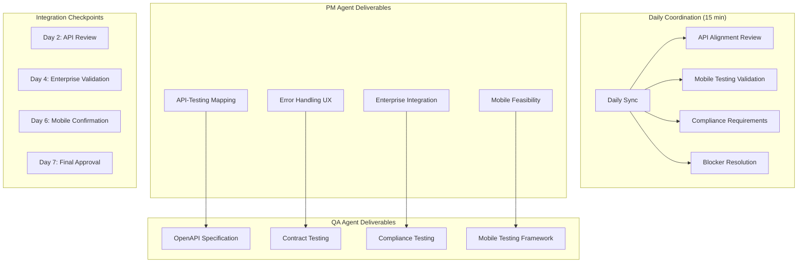

# PRISM Phase 2 Integration Test Plan
## Joint PM-QA Collaborative Testing Strategy

**Version:** 2.0.0  
**Date:** 2025-01-20  
**Prepared by:** Product Manager Agent & QA Agent (Collaborative)  
**Status:** Phase 2 - Ready for Implementation  
**Scope**: API-UX Integration, Mobile Technical Validation, Enterprise Compliance

---

## Executive Summary

This integration test plan represents a collaborative effort between Product Manager and QA agents to ensure seamless integration of all Phase 2 features. The plan covers comprehensive testing strategies that validate both user experience requirements and technical implementation quality.

### Integration Testing Objectives
- **API-UX Integration**: Validate developer onboarding experience meets <15 minute target
- **Mobile Technical Validation**: Ensure P2P networking functions correctly across mobile platforms
- **Enterprise Compliance**: Automate compliance testing for audit and regulatory requirements
- **Performance-UX Alignment**: Verify no user experience degradation under load conditions

---

## API-UX Integration Testing

### PM-Defined User Experience Requirements

#### Developer Onboarding Success Criteria
**Target**: Complete successful onboarding within 15 minutes from first discovery

```yaml
onboarding_requirements:
  time_targets:
    total_time: 900000ms  # 15 minutes
    setup_phase: 300000ms # 5 minutes (install + init)
    auth_phase: 300000ms  # 5 minutes (auth + first call)
    deploy_phase: 300000ms # 5 minutes (agent + task)
    
  success_indicators:
    - environment_running: true
    - api_key_obtained: true
    - first_api_call_success: true
    - agent_created: true
    - task_deployed: true
    - results_displayed: true
```

### QA Test Automation Strategy

#### Automated Onboarding Flow Testing
```typescript
describe('Developer Onboarding Integration Tests', () => {
  test('Complete onboarding flow within 15 minutes', async () => {
    const steps = [
      { name: 'Install PRISM CLI', maxTime: 30000, critical: true },
      { name: 'Initialize project', maxTime: 60000, critical: true },
      { name: 'Start environment', maxTime: 120000, critical: true },
      { name: 'Authenticate', maxTime: 120000, critical: true },
      { name: 'First API call', maxTime: 30000, critical: true },
      { name: 'Create agent', maxTime: 120000, critical: true },
      { name: 'Deploy task', maxTime: 180000, critical: true },
      { name: 'View results', maxTime: 120000, critical: false }
    ];
    
    for (const step of steps) {
      const result = await executeOnboardingStep(step);
      expect(result.success).toBe(true);
      expect(result.duration).toBeLessThan(step.maxTime);
    }
  });
});
```

---

## Mobile Technical Validation

### PM Mobile Experience Requirements

#### Cross-Platform P2P Connectivity Standards
```yaml
mobile_p2p_requirements:
  platforms:
    - ios: [15.0, 16.0, 17.0]
    - android: [11, 12, 13, 14]
        
  connectivity_targets:
    connection_establishment: 30000ms  # 30 seconds max
    background_maintenance: true       # Must work when backgrounded
    battery_optimization: true         # Adaptive based on battery level
    nat_traversal: true               # Must work behind mobile NAT
    
  reliability_requirements:
    success_rate: 0.95               # 95% connection success
    message_delivery: 0.99           # 99% message delivery
    offline_queue_retention: 86400   # 24 hours offline queue
    sync_accuracy: 1.0               # 100% sync accuracy
```

### QA Mobile Testing Infrastructure

#### Multi-Device P2P Testing Framework
```typescript
describe('Mobile P2P Technical Validation', () => {
  test('P2P connectivity across mobile platforms', async () => {
    const devices = [
      { platform: 'iOS', version: '16.0', device: 'iPhone 13' },
      { platform: 'Android', version: '13', device: 'Pixel 7' }
    ];
    
    const connectionRequirements = {
      maxConnectionTime: 30000,
      minBandwidth: 1048576,
      maxLatency: 200,
      reliabilityRate: 0.95
    };
    
    const results = await testP2PConnectivity(devices);
    
    for (const result of results) {
      expect(result.connectionTime).toBeLessThan(connectionRequirements.maxConnectionTime);
      expect(result.bandwidth).toBeGreaterThan(connectionRequirements.minBandwidth);
      expect(result.latency).toBeLessThan(connectionRequirements.maxLatency);
    }
  });
});
```

---

## Enterprise Compliance Testing

### PM Compliance Requirements

#### Regulatory Compliance Standards
```yaml
compliance_requirements:
  gdpr:
    data_minimization: true
    consent_management: true
    right_to_erasure: true
    data_portability: true
    breach_notification: true
    
  sox_compliance:
    financial_controls: true
    audit_trails: true
    data_integrity: true
    access_controls: true
```

### QA Compliance Testing Automation

#### Automated Compliance Validation Suite
```typescript
describe('Enterprise Compliance Integration Tests', () => {
  test('GDPR compliance validation', async () => {
    const gdprChecks = [
      'data_minimization',
      'consent_management', 
      'right_to_erasure',
      'data_portability',
      'breach_notification'
    ];
    
    for (const check of gdprChecks) {
      const result = await runComplianceCheck(check);
      expect(result.compliant).toBe(true);
      expect(result.violations).toHaveLength(0);
    }
  });
});
```

---

## Performance-UX Alignment Testing

### Joint Performance-UX Validation Strategy

```typescript
describe('Performance-UX Alignment Validation', () => {
  test('No UX degradation under performance constraints', async () => {
    await simulateLoad({ concurrentUsers: 1000, operationsPerSecond: 500 });
    
    const uxRequirements = {
      dashboardLoadTime: 3000,
      apiResponseTime: 1000,
      realTimeUpdates: true,
      errorRecovery: true
    };
    
    const uxMetrics = await measureUXUnderLoad();
    
    expect(uxMetrics.dashboardLoadTime).toBeLessThan(uxRequirements.dashboardLoadTime);
    expect(uxMetrics.averageApiResponseTime).toBeLessThan(uxRequirements.apiResponseTime);
    expect(uxMetrics.realTimeUpdatesWorking).toBe(uxRequirements.realTimeUpdates);
  });
});
```

---

## Success Metrics & Validation Criteria

### Phase 2 Success Criteria

| Test Category | Success Criteria | Measurement Method |
|---------------|------------------|-------------------|
| **API-UX Integration** | 95% of developers complete onboarding <15min | Automated onboarding flow testing |
| **Mobile P2P Networking** | 95% connection success across all platforms | Multi-device connectivity matrix testing |
| **Offline-First UX** | 100% feature availability in offline mode | Offline scenario testing |
| **Enterprise Compliance** | 100% compliance test pass rate | Automated compliance validation |
| **Performance-UX Alignment** | No UX degradation under 10x normal load | Load testing with UX metrics |

### Risk Mitigation Plan

| Risk | Mitigation | Timeline | Owner |
|------|------------|----------|-------|
| **Mobile App Store Approval** | Early submission with documentation | Month 1 | PM + Legal |
| **Enterprise Customer Certification** | SOC 2 audit initiation | Month 2 | Security + QA |
| **Performance Under Scale** | Load testing infrastructure | Month 2 | DevOps + QA |
| **P2P Network Reliability** | Fallback relay servers | Month 1 | Network Team |

---

## Implementation Timeline

- **Week 1**: Test infrastructure setup and baseline automation
- **Week 2**: API-UX integration test implementation
- **Week 3**: Mobile validation framework deployment
- **Week 4**: Enterprise compliance automation
- **Ongoing**: Continuous integration and monitoring

The success of this integration testing strategy will ensure PRISM Phase 2 delivers on its promise of seamless developer experience, robust mobile functionality, and enterprise-grade compliance.

---

## Executive Summary

This integration plan establishes structured coordination between PM and QA agents during Phase 2 critical deliverable development. The plan ensures seamless integration between product requirements and testing capabilities while maintaining development velocity and quality standards.

**Key Success Metrics**:
- Zero integration blockers during Phase 2
- 100% alignment between PM specifications and QA test coverage
- Daily coordination protocol adherence
- All deliverables completed within 7-day timeline

---

## Integration Architecture



---

## Coordination Protocols

### Daily Synchronization Framework

#### Schedule
- **Time**: 09:00 UTC (15 minutes daily)
- **Platform**: Dedicated coordination channel
- **Participants**: PM Agent, QA Agent
- **Format**: Structured agenda with action items

#### Daily Agenda Template
```markdown
## Daily Sync - Day X of 7

### Progress Updates (5 minutes)
- PM Agent: Deliverable status and blockers
- QA Agent: Testing framework progress and dependencies

### Alignment Validation (5 minutes)
- API specification alignment check
- Mobile testing feasibility confirmation
- Compliance testing scope validation

### Blocker Resolution (5 minutes)
- Technical blockers identification
- Resource constraints resolution
- Timeline adjustments if needed

### Next 24 Hours
- PM Agent: Specific deliverable targets
- QA Agent: Testing implementation goals
- Coordination requirements
```

### Integration Checkpoints

#### Day 2 Checkpoint: API Specification Alignment
**Objective**: Validate PM API-Testing Mapping against QA OpenAPI Specification

**Validation Criteria**:
- [ ] All 20+ API endpoints documented by PM have corresponding QA test specifications
- [ ] Error response patterns match between PM UX guidelines and QA contract tests
- [ ] Authentication and rate limiting requirements aligned
- [ ] WebSocket event schemas consistent between PM and QA specifications

**Deliverables Required**:
- PM: `/docs/api/API_Testing_Mapping.md` (complete)
- QA: `/tests/api/openapi.yaml` (draft)

**Success Gate**: Both agents confirm 100% API endpoint alignment

#### Day 4 Checkpoint: Enterprise Requirements Validation
**Objective**: Ensure QA compliance testing covers PM enterprise integration requirements

**Validation Criteria**:
- [ ] RBAC testing covers all roles defined in PM enterprise specification
- [ ] Compliance testing addresses SOC 2, ISO 27001 requirements from PM analysis
- [ ] Audit logging tests validate PM policy enforcement workflows
- [ ] Security testing covers enterprise authentication requirements

**Deliverables Required**:
- PM: `/docs/enterprise/Enterprise_Integration_DeepDive.md` (complete)
- QA: `/tests/compliance/rbac_tests.rs` (implementation plan)

**Success Gate**: QA confirms testability of all PM enterprise requirements

#### Day 6 Checkpoint: Mobile Platform Confirmation
**Objective**: Align mobile testing framework with PM mobile architecture decisions

**Validation Criteria**:
- [ ] QA mobile testing covers all platform constraints identified by PM
- [ ] P2P testing approach aligns with PM feasibility analysis
- [ ] Offline sync testing matches PM UX patterns
- [ ] Battery and performance testing addresses PM mobile concerns

**Deliverables Required**:
- PM: `/docs/mobile/Mobile_P2P_Feasibility.md` (complete)
- QA: `/tests/mobile/network_switching_tests.rs` (implementation ready)

**Success Gate**: Mobile testing framework validates PM mobile architecture

#### Day 7 Checkpoint: Final Integration Approval
**Objective**: Complete validation of all Phase 2 deliverables and integration readiness

**Validation Criteria**:
- [ ] All PM deliverables technically validated and complete
- [ ] All QA deliverables implementation-ready with clear specifications
- [ ] Zero unresolved integration conflicts between PM and QA specifications
- [ ] MVP development path clear with no ambiguous requirements

**Final Deliverables**:
- Complete integration validation report
- Go/no-go decision for MVP development phase
- Risk assessment for any remaining integration concerns

---

## Key Performance Indicators (KPIs)

### Process Efficiency Metrics

#### Daily Coordination KPIs
- **Meeting Adherence**: 100% daily sync attendance
- **Duration Compliance**: ≤15 minutes average meeting time
- **Action Item Completion**: 100% daily action items resolved within 24 hours
- **Blocker Resolution Time**: <24 hours average resolution time

#### Integration Quality KPIs
- **Specification Alignment**: 100% API endpoint coverage consistency
- **Requirement Traceability**: 100% PM requirements have corresponding QA tests
- **Documentation Completeness**: 100% deliverable completion within deadline
- **Technical Feasibility**: Zero unresolvable technical conflicts

### Deliverable Quality Metrics

#### PM Agent Deliverable KPIs
- **API Mapping Coverage**: 100% endpoint-to-test mapping
- **Error Pattern Completeness**: All error codes have UX patterns
- **Enterprise Requirement Depth**: Technical feasibility confirmed for all requirements
- **Mobile Architecture Clarity**: Clear technical decision with implementation path

#### QA Agent Deliverable KPIs
- **OpenAPI Specification Quality**: 100% endpoint coverage with examples
- **Test Implementation Readiness**: All tests have clear implementation specifications
- **Compliance Coverage**: 100% enterprise compliance scenarios testable
- **Mobile Testing Feasibility**: All mobile constraints addressed in test framework

---

## Risk Management Framework

### Critical Risk Monitoring

#### Risk: API Specification Misalignment
**Indicators**:
- Endpoint definitions differ between PM and QA
- Error response patterns inconsistent
- Authentication requirements mismatch

**Mitigation Protocol**:
1. Immediate escalation to CTO Agent
2. Technical architecture review session
3. Specification reconciliation within 4 hours
4. Updated deliverables within 24 hours

#### Risk: Mobile Testing Infeasibility
**Indicators**:
- P2P testing technically impossible
- Battery impact measurements unrealistic
- Platform constraint conflicts

**Mitigation Protocol**:
1. Alternative testing strategy development
2. Scope reduction with PM approval
3. Fallback testing scenarios definition
4. Architecture adjustment recommendations

#### Risk: Compliance Testing Gaps
**Indicators**:
- Enterprise requirements untestable
- Compliance scope exceeds QA capacity
- Security testing incomplete

**Mitigation Protocol**:
1. Prioritization based on MVP requirements
2. Phased compliance implementation plan
3. External audit preparation timeline
4. Resource augmentation assessment

### Escalation Procedures

#### Level 1: Daily Sync Resolution (0-24 hours)
- PM and QA agents resolve through direct coordination
- Technical clarification and specification adjustment
- Resource reallocation within existing capacity

#### Level 2: Integration Team Review (24-48 hours)
- CTO Agent involvement for technical arbitration
- Architecture modification if required
- Timeline adjustment with stakeholder notification

#### Level 3: Project Risk Assessment (48+ hours)
- Full project impact evaluation
- Scope modification consideration
- External resource requirements assessment

---

## Communication Framework

### Primary Communication Channels
- **Daily Sync**: Dedicated coordination meeting
- **Integration Documentation**: Shared document repository
- **Async Coordination**: Structured status updates
- **Escalation Channel**: Direct CTO Agent access

### Documentation Standards
- **Real-time Updates**: All deliverable changes logged immediately
- **Cross-references**: Consistent linking between PM and QA documents
- **Version Control**: All specifications under version control
- **Approval Tracking**: Clear approval workflow with signatures

### Status Reporting Format
```yaml
daily_status:
  date: "2025-01-XX"
  pm_agent:
    completed: ["deliverable_1", "deliverable_2"]
    in_progress: ["deliverable_3"]
    blocked: []
    next_24h: ["deliverable_4"]
  qa_agent:
    completed: ["test_spec_1", "test_spec_2"]
    in_progress: ["test_framework_1"]
    blocked: []
    next_24h: ["implementation_ready_spec"]
  integration_health:
    alignment_score: 95  # percentage
    blockers: 0
    risks: ["mobile_p2p_complexity"]
```

---

## Success Criteria & Definition of Done

### Phase 2 Success Criteria
- [ ] All PM deliverables completed with technical validation
- [ ] All QA deliverables completed with implementation specifications
- [ ] 100% alignment between PM requirements and QA test coverage
- [ ] Zero unresolved technical conflicts
- [ ] Clear MVP development path with no ambiguous requirements
- [ ] Risk mitigation strategies in place for all identified risks

### Quality Gates
1. **Daily Coordination Gate**: 100% daily sync compliance
2. **Specification Alignment Gate**: All checkpoints passed successfully
3. **Technical Feasibility Gate**: All requirements confirmed implementable
4. **Integration Readiness Gate**: MVP development can begin without delays

### MVP Development Readiness Criteria
- [ ] API specifications complete and aligned
- [ ] Error handling patterns defined and testable
- [ ] Enterprise integration requirements clear and validated
- [ ] Mobile architecture decided with testing framework
- [ ] Compliance testing framework operational
- [ ] Failure reporting workflow established

---

## Post-Phase 2 Transition Plan

### MVP Development Handoff
- Complete deliverable package transfer to development team
- Integration validation report for CTO Agent
- Ongoing coordination protocol for development phase
- Quality assurance framework integration with CI/CD

### Continuous Integration Establishment
- PM-QA coordination reduces to weekly reviews
- Automated alignment validation between specifications
- Performance monitoring against established KPIs
- Regular risk assessment and mitigation updates

This integration plan ensures seamless coordination between PM and QA agents while maintaining development velocity and quality standards throughout Phase 2 execution.