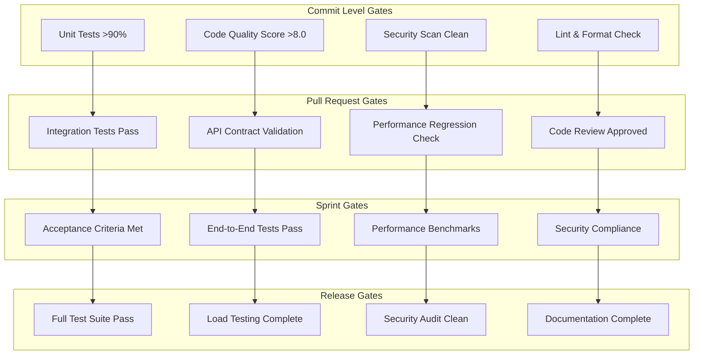

# PRISM Quality Gate Configuration
## Continuous Alignment Framework Implementation

**Version**: 2.0.0  
**Date**: January 21, 2025  
**Status**: Active - Sprint 1 Implementation  
**Scope**: MVP development quality assurance and continuous monitoring  

---

## Quality Gate Architecture

### Multi-Level Quality Assurance System



---

## Commit Level Quality Gates

### Gate 1: Unit Test Coverage
**Threshold**: >90% coverage  
**Automation**: GitHub Actions pre-commit hook  
**Failure Action**: Commit rejected, developer notification  

```yaml
unit_test_gate:
  coverage_threshold: 90
  frameworks:
    rust: cargo-tarpaulin
    typescript: jest
    react: react-testing-library
  exclusions:
    - "tests/**"
    - "**/*.test.*"
    - "mock/**"
  failure_action:
    - block_commit: true
    - notify_developer: true
    - suggest_fixes: true
```

**Implementation**:
```bash
# Pre-commit hook
#!/bin/bash
echo "Running unit test coverage check..."
coverage=$(npm run test:coverage --silent | grep "All files" | awk '{print $10}')
if (( $(echo "$coverage < 90" | bc -l) )); then
    echo "❌ Unit test coverage $coverage% is below 90% threshold"
    echo "Please add tests to improve coverage before committing"
    exit 1
fi
echo "✅ Unit test coverage: $coverage%"
```

### Gate 2: Code Quality Score
**Threshold**: >8.0/10 score  
**Tools**: SonarQube, ESLint, Clippy  
**Failure Action**: Commit blocked with specific improvement suggestions  

```yaml
code_quality_gate:
  minimum_score: 8.0
  tools:
    rust: clippy
    typescript: eslint + prettier
    react: eslint-plugin-react-hooks
  metrics:
    - complexity: <10_per_function
    - duplication: <5%
    - maintainability: >A_rating
    - reliability: >A_rating
```

### Gate 3: Security Scan
**Tools**: cargo-audit, npm audit, Snyk  
**Threshold**: Zero high/critical vulnerabilities  
**Failure Action**: Commit blocked, security team notification  

```yaml
security_scan_gate:
  vulnerability_threshold:
    critical: 0
    high: 0
    medium: 5  # Maximum allowed
    low: 20    # Maximum allowed
  tools:
    - cargo_audit: "Rust dependency vulnerabilities"
    - npm_audit: "Node.js dependency vulnerabilities"  
    - snyk: "Container and code vulnerabilities"
  failure_action:
    - block_commit: true
    - notify_security_team: true
    - create_jira_ticket: true
```

---

## Pull Request Quality Gates

### Gate 4: Integration Test Validation
**Scope**: API endpoints, service communication, database integration  
**Threshold**: 100% critical path coverage  
**Failure Action**: PR blocked until tests pass  

```yaml
integration_test_gate:
  test_suites:
    api_tests:
      framework: supertest
      coverage: 100%  # All endpoints
      timeout: 30s
    service_tests:
      framework: rust_integration_tests
      coverage: 95%   # Service-to-service communication
      timeout: 60s
    database_tests:
      framework: diesel_test
      coverage: 90%   # Database operations
      timeout: 30s
```

**Test Categories**:
```typescript
// API Integration Tests
describe('Agent Management API Integration', () => {
  test('POST /api/v1/agents creates agent successfully', async () => {
    const response = await request(app)
      .post('/api/v1/agents')
      .send(validAgentConfig)
      .expect(201);
    
    expect(response.body.id).toBeDefined();
    expect(response.body.status).toBe('creating');
  });
  
  test('GET /api/v1/agents returns paginated results', async () => {
    const response = await request(app)
      .get('/api/v1/agents?limit=10&offset=0')
      .expect(200);
    
    expect(response.body.agents).toHaveLength(10);
    expect(response.body.total).toBeGreaterThan(0);
  });
});
```

### Gate 5: API Contract Validation
**Tool**: OpenAPI specification validation  
**Scope**: Request/response schema compliance  
**Threshold**: 100% endpoint compliance  

```yaml
contract_validation_gate:
  openapi_version: "3.0.3"
  validation_tools:
    - swagger-codegen-cli
    - openapi-typescript-codegen
  checks:
    - request_schema_validation: true
    - response_schema_validation: true
    - parameter_validation: true
    - error_response_consistency: true
```

**Validation Example**:
```typescript
// Contract validation test
import { validateResponse } from '@apidevtools/swagger-parser';

test('Agent creation response matches OpenAPI spec', async () => {
  const response = await createAgent(validConfig);
  const validation = await validateResponse(
    openApiSpec, 
    '/api/v1/agents', 
    'post', 
    201, 
    response.body
  );
  expect(validation.valid).toBe(true);
});
```

---

## Sprint Boundary Quality Gates

### Gate 6: Acceptance Criteria Validation
**Process**: Automated acceptance test execution  
**Threshold**: 100% acceptance criteria met  
**Validation**: Product Manager Agent approval required  

```yaml
acceptance_criteria_gate:
  validation_method: automated_tests + manual_verification
  test_framework: cypress + playwright
  approval_required:
    - product_manager_agent: true
    - tech_lead: true
  criteria_tracking:
    - functional_requirements: 100%
    - performance_requirements: 100%
    - usability_requirements: 95%
    - accessibility_requirements: 100%
```

**Acceptance Test Example**:
```typescript
// Cypress acceptance test
describe('Agent Creation User Journey', () => {
  it('should complete agent creation within 2 minutes', () => {
    const startTime = Date.now();
    
    cy.visit('/dashboard');
    cy.get('[data-testid="create-agent-button"]').click();
    
    // Step through wizard
    cy.get('[data-testid="agent-type-cto"]').click();
    cy.get('[data-testid="next-step"]').click();
    
    // Configure resources
    cy.get('[data-testid="cpu-slider"]').setValue(2);
    cy.get('[data-testid="memory-slider"]').setValue(4);
    cy.get('[data-testid="next-step"]').click();
    
    // Deploy agent
    cy.get('[data-testid="deploy-agent"]').click();
    
    // Verify completion
    cy.get('[data-testid="deployment-success"]').should('be.visible');
    cy.get('[data-testid="agent-id"]').should('not.be.empty');
    
    const endTime = Date.now();
    expect(endTime - startTime).toBeLessThan(120000); // 2 minutes
  });
});
```

### Gate 7: Performance Benchmark Validation
**Metrics**: API response time, UI load time, throughput  
**Thresholds**: <100ms API, <3s UI, >1000 concurrent users  
**Tool**: Artillery.js load testing, Lighthouse performance audits  

```yaml
performance_gate:
  api_performance:
    response_time_p95: 100ms
    response_time_p99: 500ms
    throughput: 1000_requests_per_second
    concurrent_users: 1000
    
  ui_performance:
    first_contentful_paint: 1500ms
    largest_contentful_paint: 2500ms
    cumulative_layout_shift: 0.1
    first_input_delay: 100ms
    
  load_testing:
    tool: artillery
    duration: 300s  # 5 minutes
    ramp_up: 60s    # Gradual load increase
```

**Performance Test Configuration**:
```yaml
# artillery-load-test.yml
config:
  target: 'http://localhost:4001'
  phases:
    - duration: 60
      arrivalRate: 10
      rampTo: 100
    - duration: 300
      arrivalRate: 100
  defaults:
    headers:
      Authorization: 'Bearer {{ $randomString() }}'

scenarios:
  - name: 'Agent Management Workflow'
    weight: 100
    flow:
      - post:
          url: '/api/v1/agents'
          json:
            type: 'CTO'
            name: 'load-test-agent'
          capture:
            - json: $.id
              as: agentId
      - get:
          url: '/api/v1/agents/{{ agentId }}'
      - delete:
          url: '/api/v1/agents/{{ agentId }}'
```

---

## Continuous Monitoring & Alerting

### Real-time Quality Metrics Dashboard

```yaml
quality_dashboard:
  metrics:
    code_coverage:
      current: 92%
      trend: +2%
      target: 90%
      alert_threshold: 85%
      
    test_success_rate:
      current: 98.5%
      trend: +0.5%
      target: 95%
      alert_threshold: 90%
      
    api_response_time:
      current: 78ms
      trend: -5ms
      target: 100ms
      alert_threshold: 150ms
      
    deployment_success_rate:
      current: 100%
      trend: 0%
      target: 98%
      alert_threshold: 95%
```

### Automated Alert Configuration

```yaml
alerting_rules:
  critical_alerts:
    - name: "Test Coverage Drop"
      condition: "coverage < 85%"
      severity: critical
      channels: [slack, email]
      escalation: tech_lead
      
    - name: "API Performance Degradation" 
      condition: "response_time_p95 > 200ms"
      severity: critical
      channels: [slack, pager]
      escalation: on_call_engineer
      
    - name: "Security Vulnerability"
      condition: "critical_vulnerabilities > 0"
      severity: critical  
      channels: [slack, email, security_team]
      escalation: security_lead
      
  warning_alerts:
    - name: "Test Flakiness"
      condition: "flaky_test_rate > 5%"
      severity: warning
      channels: [slack]
      escalation: qa_lead
```

### Quality Trend Analysis

```yaml
trend_monitoring:
  daily_reports:
    - coverage_trend: "Track test coverage changes"
    - performance_trend: "Monitor API/UI performance metrics"
    - quality_score_trend: "Code quality evolution"
    
  weekly_analysis:
    - technical_debt_accumulation: "Measure debt increase"
    - bug_discovery_rate: "Track defects found vs resolved"
    - velocity_vs_quality: "Balance speed and quality metrics"
    
  monthly_review:
    - quality_gate_effectiveness: "Assess gate success rates"
    - team_productivity_impact: "Quality gate impact on velocity"
    - continuous_improvement: "Process optimization recommendations"
```

---

## Failure Recovery Procedures

### Quality Gate Failure Workflows

#### Commit Gate Failure
```yaml
commit_failure_workflow:
  immediate_actions:
    - block_commit: true
    - display_failure_reason: detailed_error_message
    - suggest_fixes: automated_recommendations
    
  developer_actions:
    - fix_issues: "Address specific quality violations"
    - rerun_checks: "Validate fixes before retry"
    - escalate_if_needed: "Contact tech lead for guidance"
    
  escalation_triggers:
    - repeated_failures: 3_attempts
    - complex_issues: security_vulnerabilities
    - time_sensitive: sprint_deadline_approaching
```

#### Sprint Gate Failure
```yaml
sprint_failure_workflow:
  assessment:
    - impact_analysis: "Assess feature completeness"
    - timeline_impact: "Calculate delay implications"
    - quality_vs_timeline: "Evaluate trade-offs"
    
  decision_matrix:
    critical_features:
      - must_fix: "Core functionality issues"
      - can_defer: "Nice-to-have enhancements"
    
    quality_issues:
      - must_fix: "Security, performance, accessibility"
      - can_defer: "Minor UX improvements"
      
  stakeholder_communication:
    - pm_agent_notification: immediate
    - stakeholder_update: within_24_hours
    - revised_timeline: updated_sprint_plan
```

---

## Continuous Improvement Framework

### Quality Metrics Evolution

```yaml
improvement_cycle:
  weekly_review:
    - gate_effectiveness: "Measure false positive/negative rates"
    - developer_feedback: "Collect usability feedback on gates"
    - performance_impact: "Assess gate execution time"
    
  monthly_optimization:
    - threshold_adjustment: "Fine-tune based on team performance"
    - new_gate_proposals: "Add gates for emerging quality needs"
    - gate_retirement: "Remove ineffective or redundant gates"
    
  quarterly_assessment:
    - roi_analysis: "Quality investment vs bug prevention"
    - benchmark_comparison: "Industry standard comparison"
    - strategic_alignment: "Business goal alignment check"
```

### Automated Quality Improvement

```yaml
auto_improvement:
  adaptive_thresholds:
    - coverage_targets: "Adjust based on codebase maturity"
    - performance_budgets: "Optimize based on user behavior"
    - complexity_limits: "Evolve with team expertise"
    
  intelligent_suggestions:
    - test_gap_identification: "AI-powered test coverage analysis"
    - refactoring_opportunities: "Automated code smell detection"
    - performance_optimization: "Bottleneck identification and fixes"
```

---

## Implementation Roadmap

### Phase 1: Foundation (Week 1)
- [ ] Set up basic quality gates for commit and PR levels
- [ ] Configure automated testing pipelines
- [ ] Implement core monitoring and alerting
- [ ] Train development team on quality gate processes

### Phase 2: Enhancement (Week 2-3)
- [ ] Add performance and acceptance criteria gates
- [ ] Implement advanced security scanning
- [ ] Set up quality metrics dashboard
- [ ] Configure failure recovery workflows

### Phase 3: Optimization (Week 4+)
- [ ] Fine-tune gate thresholds based on team performance
- [ ] Add intelligent quality suggestions
- [ ] Implement adaptive threshold management
- [ ] Continuous improvement automation

This comprehensive quality gate configuration ensures PRISM maintains high standards throughout development while enabling rapid iteration and continuous delivery.