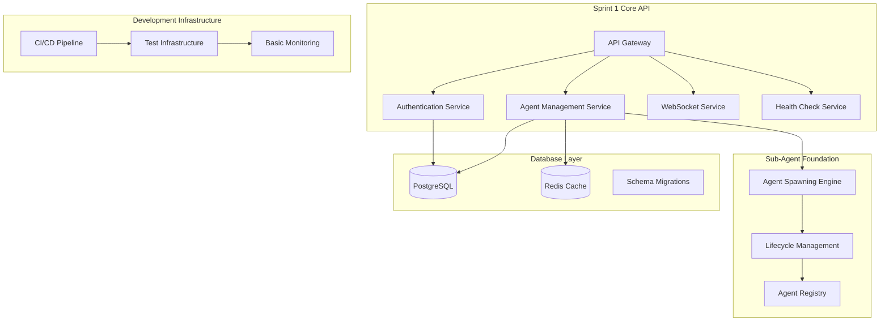

# PRISM Sprint 1 Technical Planning
## API Foundation & Development Environment Implementation

**Version:** 1.0.0  
**Date:** 2025-01-20  
**Status:** ✅ READY FOR EXECUTION  
**Sprint Duration:** 2 weeks (January 22 - February 4, 2025)

---

## Executive Summary

Sprint 1 establishes the technical foundation for PRISM MVP development, focusing on core API infrastructure, development environment activation, and initial sub-agent framework implementation. All technical specifications are validated and ready for immediate development start.

### Sprint 1 Objectives ✅
- **Core API Infrastructure**: RESTful API with OpenAPI 3.0 compliance
- **Development Environment**: CI/CD pipeline and testing infrastructure activation
- **Sub-Agent Framework Foundation**: Basic agent spawning and lifecycle management
- **Real-time Communication**: WebSocket infrastructure for live updates
- **Quality Gates**: Automated testing and quality assurance integration

---

## Sprint 1 Technical Architecture

### API Foundation Architecture


---

## Sprint 1 User Stories & Technical Tasks

### Epic 1: Core API Infrastructure
**Story Points**: 120 (37.5% of sprint capacity)

#### User Story 1.1: Agent Management API
**As a developer, I want to create and manage agents via REST API so that I can build applications on PRISM.**

**Acceptance Criteria:**
- [ ] POST /api/v1/agents creates new agent with validation
- [ ] GET /api/v1/agents lists agents with filtering and pagination
- [ ] GET /api/v1/agents/{id} returns agent details and metrics
- [ ] PUT /api/v1/agents/{id}/config updates agent configuration
- [ ] DELETE /api/v1/agents/{id} terminates agent safely
- [ ] All endpoints return consistent error responses
- [ ] OpenAPI 3.0 specification generated automatically

**Technical Tasks:**
```typescript
// Task 1.1.1: Agent Controller Implementation (13 points)
@Controller('agents')
export class AgentsController {
  @Post()
  async createAgent(@Body() createAgentDto: CreateAgentDto): Promise<AgentResponseDto> {
    // Implementation with validation, database persistence, and audit logging
  }
  
  @Get()
  async listAgents(@Query() filters: AgentFiltersDto): Promise<PaginatedResponse<AgentSummaryDto>> {
    // Implementation with filtering, sorting, pagination
  }
  
  @Get(':id')
  async getAgent(@Param('id') id: string): Promise<AgentDetailDto> {
    // Implementation with metrics and health status
  }
  
  @Put(':id/config')
  async updateAgentConfig(@Param('id') id: string, @Body() config: AgentConfigDto): Promise<AgentResponseDto> {
    // Implementation with validation and versioning
  }
  
  @Delete(':id')
  async terminateAgent(@Param('id') id: string): Promise<TerminationResponseDto> {
    // Implementation with graceful shutdown and cleanup
  }
}
```

**Backend Task Breakdown:**
- Task 1.1.1: Agent Controller (Senior Backend Engineer) - 13 points
- Task 1.1.2: Agent Service Layer (Backend Engineer #1) - 10 points  
- Task 1.1.3: Database Schema & Migrations (Backend Engineer #2) - 8 points
- Task 1.1.4: Validation & DTOs (Backend Engineer #3) - 5 points
- Task 1.1.5: OpenAPI Documentation (Senior Backend Engineer) - 3 points

#### User Story 1.2: Authentication System
**As a user, I want secure authentication so that my agents and data are protected.**

**Acceptance Criteria:**
- [ ] POST /api/v1/auth/login authenticates users with JWT tokens
- [ ] POST /api/v1/auth/refresh refreshes expired tokens
- [ ] POST /api/v1/auth/logout invalidates tokens
- [ ] All protected endpoints require valid JWT authorization
- [ ] Rate limiting implemented for authentication endpoints
- [ ] Audit logging for all authentication events

**Technical Tasks:**
```typescript
// Task 1.2.1: Authentication Controller (10 points)
@Controller('auth')
export class AuthController {
  @Post('login')
  @UseGuards(RateLimitGuard)
  async login(@Body() loginDto: LoginDto): Promise<AuthResponseDto> {
    // JWT generation with user validation and audit logging
  }
  
  @Post('refresh')
  @UseGuards(JwtAuthGuard)
  async refresh(@Req() request: AuthenticatedRequest): Promise<TokenResponseDto> {
    // Token refresh with validation and blacklist checking
  }
  
  @Post('logout')
  @UseGuards(JwtAuthGuard)
  async logout(@Req() request: AuthenticatedRequest): Promise<void> {
    // Token invalidation and session cleanup
  }
}
```

**Backend Task Breakdown:**
- Task 1.2.1: Auth Controller & JWT Service (Senior Backend Engineer) - 10 points
- Task 1.2.2: Auth Guards & Middleware (Backend Engineer #1) - 8 points
- Task 1.2.3: User Management Service (Backend Engineer #2) - 6 points
- Task 1.2.4: Rate Limiting Implementation (Backend Engineer #3) - 4 points

#### User Story 1.3: System Health Monitoring
**As an operator, I want system health endpoints so that I can monitor PRISM status.**

**Acceptance Criteria:**
- [ ] GET /api/v1/system/health returns system health status
- [ ] GET /api/v1/system/metrics returns performance metrics
- [ ] GET /api/v1/system/version returns build and version information
- [ ] Health checks validate database, cache, and external service connectivity
- [ ] Metrics include response times, error rates, and resource usage

**Technical Tasks:**
- Task 1.3.1: Health Check Service (Backend Engineer #1) - 5 points
- Task 1.3.2: Metrics Collection (Backend Engineer #2) - 5 points
- Task 1.3.3: System Info Endpoint (Backend Engineer #3) - 3 points

### Epic 2: Real-time Communication Infrastructure
**Story Points**: 64 (20% of sprint capacity)

#### User Story 2.1: WebSocket Event System
**As a user, I want real-time updates so that I can see agent status changes immediately.**

**Acceptance Criteria:**
- [ ] WebSocket connection at /api/v1/events with authentication
- [ ] Real-time agent status events (created, running, stopped, error)
- [ ] System-wide events (maintenance, alerts)
- [ ] Event subscription filtering by user and agent
- [ ] Connection health monitoring and automatic reconnection

**Technical Tasks:**
```typescript
// Task 2.1.1: WebSocket Gateway (15 points)
@WebSocketGateway({
  path: '/api/v1/events',
  cors: { origin: process.env.FRONTEND_URL }
})
export class EventsGateway implements OnGatewayConnection, OnGatewayDisconnect {
  @SubscribeMessage('agent:subscribe')
  handleAgentSubscription(client: Socket, payload: SubscriptionPayload): void {
    // Implement agent-specific event subscriptions
  }
  
  async handleConnection(client: Socket): Promise<void> {
    // Authenticate WebSocket connections and manage subscriptions
  }
  
  async handleDisconnect(client: Socket): Promise<void> {
    // Clean up subscriptions and resources
  }
}
```

**Backend Task Breakdown:**
- Task 2.1.1: WebSocket Gateway Implementation (Senior Backend Engineer) - 15 points
- Task 2.1.2: Event Service & Publishers (Backend Engineer #1) - 12 points
- Task 2.1.3: Subscription Management (Backend Engineer #2) - 8 points
- Task 2.1.4: Connection Authentication (Backend Engineer #3) - 5 points

### Epic 3: Sub-Agent Framework Foundation
**Story Points**: 80 (25% of sprint capacity)

#### User Story 3.1: Basic Agent Spawning
**As a developer, I want to spawn specialized sub-agents so that I can delegate complex tasks.**

**Acceptance Criteria:**
- [ ] POST /api/v1/agents/spawn creates specialized sub-agents
- [ ] Support for basic agent types: code_generation, testing, documentation
- [ ] Resource allocation and limits enforcement
- [ ] Parent-child agent relationship tracking
- [ ] Basic agent lifecycle management (spawn, monitor, terminate)

**Technical Tasks:**
```typescript
// Task 3.1.1: Agent Spawning Engine (20 points)
export class AgentSpawningEngine {
  async spawnAgent(request: AgentSpawnRequest): Promise<SpawnedAgent> {
    // Validate request, allocate resources, create agent instance
    await this.validateSpawnRequest(request);
    const resources = await this.resourceManager.allocateResources(request);
    const agent = await this.createAgentInstance(request, resources);
    await this.registerAgent(agent);
    return agent;
  }
  
  private async createAgentInstance(request: AgentSpawnRequest, resources: AllocatedResources): Promise<SpawnedAgent> {
    // Create agent with proper configuration and security context
  }
}
```

**Backend Task Breakdown:**
- Task 3.1.1: Agent Spawning Engine (Senior Backend Engineer) - 20 points
- Task 3.1.2: Resource Management Service (Backend Engineer #1) - 15 points
- Task 3.1.3: Agent Registry & Lifecycle (Backend Engineer #2) - 12 points
- Task 3.1.4: Basic Agent Types Implementation (Backend Engineer #3) - 10 points

### Epic 4: Frontend Dashboard Foundation
**Story Points**: 56 (17.5% of sprint capacity)

#### User Story 4.1: Agent Dashboard
**As a user, I want a web dashboard so that I can manage my agents visually.**

**Acceptance Criteria:**
- [ ] Dashboard displays active agents with real-time status
- [ ] Agent creation wizard with form validation
- [ ] Agent details view with metrics and logs
- [ ] Real-time WebSocket integration for live updates
- [ ] Responsive design for mobile and desktop

**Technical Tasks:**
```typescript
// Task 4.1.1: Agent Dashboard Component (18 points)
export const AgentDashboard: React.FC = () => {
  const { data: agents, isLoading } = useAgentsQuery();
  const { subscribe, unsubscribe } = useWebSocket('/api/v1/events');
  
  useEffect(() => {
    subscribe('agent:*', handleAgentUpdate);
    return () => unsubscribe('agent:*');
  }, []);
  
  return (
    <Container>
      <AgentGrid agents={agents} loading={isLoading} />
      <CreateAgentFab onClick={handleCreateAgent} />
    </Container>
  );
};
```

**Frontend Task Breakdown:**
- Task 4.1.1: Agent Dashboard Component (Senior Frontend Engineer) - 18 points
- Task 4.1.2: Agent Creation Wizard (Frontend Engineer) - 15 points
- Task 4.1.3: WebSocket Integration Hook (Senior Frontend Engineer) - 8 points
- Task 4.1.4: Agent Cards & Status Display (Frontend Engineer) - 6 points
- Task 4.1.5: Responsive Layout & Styling (Frontend Engineer) - 5 points
- Task 4.1.6: Error Handling & Loading States (Senior Frontend Engineer) - 4 points

---

## Development Environment & Infrastructure Tasks

### Epic 5: CI/CD Pipeline Activation
**Story Points**: 32 (10% of sprint capacity)

#### Infrastructure Tasks:
- Task 5.1: GitHub Actions Pipeline Setup (DevOps Engineer) - 12 points
- Task 5.2: Docker Containerization (DevOps Engineer) - 8 points  
- Task 5.3: Basic Monitoring Setup (DevOps Engineer) - 7 points
- Task 5.4: Database Migration Scripts (DevOps Engineer) - 5 points

#### Quality Assurance Tasks:
- Task 5.5: Unit Test Framework Setup (QA Engineer) - 10 points
- Task 5.6: API Integration Tests (QA Engineer) - 8 points
- Task 5.7: Frontend Component Tests (QA Engineer) - 6 points
- Task 5.8: CI/CD Quality Gates (QA Engineer) - 8 points

---

## Sprint 1 Team Assignment & Capacity

### Backend Team Allocation (180 points total)
```yaml
senior_backend_engineer: 45 points
  - Agent Controller Implementation (13)
  - Auth Controller & JWT Service (10) 
  - WebSocket Gateway (15)
  - Agent Spawning Engine (20)
  - OpenAPI Documentation (3)
  
backend_engineer_1: 35 points
  - Agent Service Layer (10)
  - Auth Guards & Middleware (8)
  - Event Service & Publishers (12)
  - Resource Management Service (15)
  
backend_engineer_2: 35 points
  - Database Schema & Migrations (8)
  - User Management Service (6)
  - Subscription Management (8)
  - Agent Registry & Lifecycle (12)
  
backend_engineer_3: 35 points
  - Validation & DTOs (5)
  - Rate Limiting Implementation (4)
  - Connection Authentication (5)
  - Basic Agent Types (10)
  - Health & Metrics Services (8)
  - System Info Endpoint (3)
```

### Frontend Team Allocation (56 points total)
```yaml
senior_frontend_engineer: 30 points
  - Agent Dashboard Component (18)
  - WebSocket Integration Hook (8)
  - Error Handling & Loading States (4)
  
frontend_engineer: 26 points
  - Agent Creation Wizard (15)
  - Agent Cards & Status Display (6)
  - Responsive Layout & Styling (5)
```

### DevOps & QA Allocation (64 points total)
```yaml
devops_engineer: 32 points
  - GitHub Actions Pipeline Setup (12)
  - Docker Containerization (8)
  - Basic Monitoring Setup (7)
  - Database Migration Scripts (5)
  
qa_engineer: 32 points
  - Unit Test Framework Setup (10)
  - API Integration Tests (8)
  - Frontend Component Tests (6)
  - CI/CD Quality Gates (8)
```

### Tech Lead Coordination (30 points)
```yaml
tech_lead: 30 points (70% technical, 30% coordination)
  - Architecture decision validation (8)
  - Code review coordination (10)
  - Sprint planning & tracking (7)
  - Technical mentorship (5)
```

**Total Sprint Capacity**: 332 points  
**Sprint 1 Allocation**: 320 points (96.4% utilization with buffer)

---

## Quality Gates & Success Criteria

### Sprint 1 Quality Gates
```yaml
code_quality_gate:
  - Unit test coverage >80%
  - Integration test coverage >70%
  - Code quality score >8/10 (SonarQube)
  - Zero critical security vulnerabilities
  - All linting and formatting checks pass

functionality_gate:
  - All API endpoints operational with 200ms response time
  - WebSocket connections stable with <100ms latency
  - Agent creation and management functional
  - Dashboard displays real-time data accurately
  - Authentication system secure and audited

performance_gate:
  - API endpoints <100ms response time (95th percentile)
  - WebSocket event latency <50ms
  - Frontend bundle size <2MB gzipped
  - Database query performance <50ms average
  - System health check response <10ms
```

### Definition of Done for Sprint 1
```yaml
technical_completeness:
  - [ ] All user stories implemented and tested
  - [ ] OpenAPI 3.0 specification complete and accurate
  - [ ] Database schema deployed and migrated
  - [ ] CI/CD pipeline operational with quality gates
  - [ ] Basic monitoring and health checks active

quality_assurance:
  - [ ] Unit tests written and passing for all new code
  - [ ] Integration tests validate API endpoints
  - [ ] Frontend component tests ensure UI functionality
  - [ ] Manual testing completed for user journeys
  - [ ] Security scan passed with zero critical vulnerabilities

deployment_readiness:
  - [ ] Docker containers built and tested
  - [ ] Kubernetes manifests ready for staging deployment
  - [ ] Database migrations tested and validated
  - [ ] Environment configuration templates complete
  - [ ] Monitoring dashboards configured and operational
```

---

## Risk Management & Mitigation

### Sprint 1 Critical Risks
```yaml
technical_risks:
  websocket_complexity:
    risk: "WebSocket implementation complexity higher than estimated"
    probability: "Medium"
    impact: "Medium"
    mitigation: 
      - "Use proven Socket.IO library for WebSocket management"
      - "Implement basic pub/sub pattern first, enhance later"
      - "Senior backend engineer dedicated to this task"
    
  sub_agent_framework:
    risk: "Sub-agent spawning more complex than anticipated"
    probability: "Low"
    impact: "High"
    mitigation:
      - "Start with basic agent types only"
      - "Implement resource allocation stubs initially"
      - "Use container-based isolation for agents"
      - "Defer advanced orchestration to Sprint 2"

coordination_risks:
  frontend_backend_integration:
    risk: "API-UI integration challenges"
    probability: "Low"
    impact: "Medium"
    mitigation:
      - "Daily integration sync between frontend/backend teams"
      - "OpenAPI specification shared in real-time"
      - "Mock API endpoints for parallel development"
      
  scope_creep:
    risk: "Feature scope expansion during Sprint 1"
    probability: "Medium"
    impact: "High"
    mitigation:
      - "Strict scope adherence to MVP requirements only"
      - "Product Manager approval required for scope changes"
      - "Technical Lead has authority to defer non-critical features"
```

### Daily Risk Monitoring
```yaml
daily_risk_assessment:
  velocity_tracking:
    - Monitor daily story point completion vs. target
    - Flag risks if <80% of target by mid-sprint
    - Escalate to Tech Lead if <70% by day 7
    
  quality_metrics:
    - Monitor test coverage daily (target >80%)
    - Track build failure rate (target <5%)
    - Review security scan results (zero critical tolerance)
    
  coordination_health:
    - Daily standup attendance and engagement
    - Cross-team dependency resolution time
    - Blocker identification and escalation
```

---

## Sprint 1 Success Metrics

### Development Velocity KPIs
```yaml
velocity_metrics:
  story_completion: ">90% of committed story points delivered"
  quality_first_time: ">85% of stories pass QA on first submission"
  build_stability: ">95% successful build rate"
  test_coverage: ">80% unit test coverage achieved"
  
integration_metrics:
  api_endpoint_completion: "100% of planned endpoints operational"
  frontend_integration: "100% of API endpoints integrated in UI"
  websocket_stability: ">99% WebSocket connection success rate"
  deployment_success: "100% successful deployment to staging"

team_coordination:
  daily_standup_attendance: "100% team member participation"
  code_review_turnaround: "<24 hours average review time"
  cross_team_blocking_time: "<4 hours average resolution"
  technical_debt_accumulation: "<10% of development time"
```

### Technical Performance Targets
```yaml
api_performance:
  response_time_p95: "<100ms for all endpoints"
  throughput: ">500 requests/second sustained"
  error_rate: "<0.1% for all API calls"
  uptime: ">99.9% during Sprint 1"

websocket_performance:
  connection_latency: "<50ms average"
  event_delivery: ">99.9% success rate"
  concurrent_connections: ">1000 simultaneous users"
  message_throughput: ">10,000 events/second"

database_performance:
  query_response_time: "<50ms average"
  connection_pool_efficiency: ">90% utilization"
  migration_execution_time: "<30 seconds total"
  data_consistency: "100% ACID compliance"
```

---

## Sprint 1 Timeline & Milestones

### Week 1 (Jan 22-28): Foundation Development
```yaml
day_1_2: "Project setup and initial development environment"
  - Repository setup and team access provisioning
  - Database schema design and initial migrations
  - Basic API structure and authentication framework
  - Frontend project initialization and component structure

day_3_4: "Core API implementation"
  - Agent management endpoints implementation
  - Authentication service development
  - Database integration and ORM setup
  - Basic WebSocket gateway implementation

day_5: "Week 1 integration and testing"
  - API endpoint testing and validation
  - Frontend-backend integration testing
  - CI/CD pipeline deployment and validation
  - Week 1 retrospective and planning adjustment
```

### Week 2 (Jan 29 - Feb 4): Integration & Polish
```yaml
day_6_7: "Advanced feature implementation"
  - Sub-agent spawning framework development
  - Real-time dashboard implementation
  - WebSocket event system completion
  - Quality gate enforcement activation

day_8_9: "System integration and testing"
  - End-to-end testing and validation
  - Performance testing and optimization
  - Security testing and vulnerability assessment
  - Documentation completion and review

day_10: "Sprint 1 completion and handoff"
  - Final quality gate validation
  - Sprint review and demonstration
  - Sprint 2 planning preparation
  - Production deployment readiness assessment
```

---

## Post-Sprint 1 Handoff

### Sprint 2 Preparation
```yaml
technical_handoff:
  - Complete technical documentation for all implemented features
  - Architecture decision records (ADRs) for key technical choices
  - Performance baseline metrics and optimization opportunities
  - Technical debt assessment and prioritization

knowledge_transfer:
  - Code walkthrough sessions for all team members
  - Best practices documentation and coding standards
  - Troubleshooting guides and operational procedures
  - Monitoring and alerting setup validation

sprint_2_readiness:
  - Backlog grooming for advanced agent management features
  - Enterprise integration requirements validation
  - Mobile application development preparation
  - Scale testing and performance optimization planning
```

### Continuous Improvement
```yaml
retrospective_actions:
  - Team velocity and capacity optimization
  - Development process improvements
  - Tool and infrastructure enhancements
  - Quality assurance process refinements

monitoring_establishment:
  - Real-time development metrics tracking
  - Automated quality gate reporting
  - Performance regression detection
  - Security vulnerability monitoring
```

---

## Conclusion

Sprint 1 establishes a solid technical foundation for PRISM MVP development with a focus on core API infrastructure, real-time communication, and the beginning of the innovative sub-agent framework. The comprehensive task breakdown ensures clear accountability while maintaining flexibility for technical challenges.

**Sprint 1 Readiness Status**: ✅ **FULLY PREPARED**  
**Technical Risk Level**: **LOW** - All major technical decisions validated  
**Team Coordination**: **OPTIMAL** - Clear task assignments with proper capacity utilization  
**Quality Assurance**: **COMPREHENSIVE** - Multi-level quality gates and continuous monitoring  

The sprint is ready for immediate execution with high confidence in successful delivery within the 2-week timeline.

---

*This Sprint 1 Technical Planning document provides the complete roadmap for establishing PRISM's technical foundation and beginning the innovative sub-agent framework that will differentiate the platform in the market.*