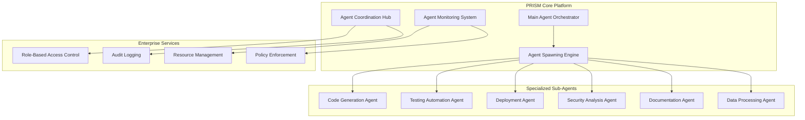

# PRISM Sub-Agent Spawning Framework
## Enterprise-Level Task Delegation & Specialized Agent Creation

**Version:** 1.0.0  
**Date:** 2025-01-20  
**Status:** Implementation Ready  
**Scope:** Enterprise sub-agent capabilities for complex task decomposition and specialized execution

---

## Executive Summary

This framework enables PRISM to spawn specialized sub-agents for complex enterprise tasks, similar to Claude Agents or OpenAI Agents. The system provides dynamic agent creation, task delegation, and coordinated execution across multiple specialized agents.

### Key Capabilities ✅
- **Dynamic Agent Spawning**: Create specialized agents on-demand for specific tasks
- **Task Decomposition**: Automatically break complex tasks into sub-agent assignments
- **Agent Orchestration**: Coordinate multiple agents working on related tasks
- **Enterprise Integration**: Full RBAC, audit logging, and compliance for agent operations
- **Resource Management**: Intelligent resource allocation and scaling for sub-agents

---

## Architecture Overview

### Sub-Agent Ecosystem


---

## Sub-Agent Types & Specializations

### Core Sub-Agent Categories
```typescript
interface SubAgentSpecialization {
  category: AgentCategory;
  capabilities: string[];
  resourceRequirements: ResourceSpec;
  securityClearance: SecurityLevel;
}

enum AgentCategory {
  CODE_GENERATION = 'code_generation',
  TESTING_AUTOMATION = 'testing_automation', 
  DEPLOYMENT_OPERATIONS = 'deployment_operations',
  SECURITY_ANALYSIS = 'security_analysis',
  DOCUMENTATION = 'documentation',
  DATA_PROCESSING = 'data_processing',
  MONITORING_ANALYSIS = 'monitoring_analysis',
  COMPLIANCE_VALIDATION = 'compliance_validation'
}

const SUB_AGENT_SPECIFICATIONS: Record<AgentCategory, SubAgentSpecialization> = {
  [AgentCategory.CODE_GENERATION]: {
    category: AgentCategory.CODE_GENERATION,
    capabilities: [
      'Generate production-ready code',
      'Implement API endpoints',
      'Create database schemas',
      'Build UI components',
      'Optimize performance',
      'Refactor legacy code'
    ],
    resourceRequirements: {
      cpu: 2,
      memory: '4GB',
      storage: '10GB',
      networkBandwidth: '100Mbps'
    },
    securityClearance: SecurityLevel.STANDARD
  },
  
  [AgentCategory.TESTING_AUTOMATION]: {
    category: AgentCategory.TESTING_AUTOMATION,
    capabilities: [
      'Generate comprehensive test suites',
      'Execute automated testing',
      'Performance benchmarking',
      'Security vulnerability scanning',
      'Compliance testing',
      'Mobile testing automation'
    ],
    resourceRequirements: {
      cpu: 4,
      memory: '8GB', 
      storage: '20GB',
      networkBandwidth: '500Mbps'
    },
    securityClearance: SecurityLevel.ELEVATED
  },
  
  [AgentCategory.SECURITY_ANALYSIS]: {
    category: AgentCategory.SECURITY_ANALYSIS,
    capabilities: [
      'Code security analysis',
      'Vulnerability assessment',
      'Compliance validation',
      'Threat modeling',
      'Security policy enforcement',
      'Incident response automation'
    ],
    resourceRequirements: {
      cpu: 3,
      memory: '6GB',
      storage: '15GB', 
      networkBandwidth: '200Mbps'
    },
    securityClearance: SecurityLevel.HIGH
  }
};
```

### Specialized Agent Capabilities
```yaml
code_generation_agent:
  primary_functions:
    - "Full-stack application development"
    - "API implementation with OpenAPI compliance"
    - "Database schema design and migration"
    - "Frontend component development"
    - "Performance optimization and refactoring"
    
  supported_technologies:
    backend: ["Node.js", "Python", "Go", "Rust", "Java"]
    frontend: ["React", "Vue", "Angular", "Svelte"]
    databases: ["PostgreSQL", "MySQL", "MongoDB", "Redis"]
    cloud: ["AWS", "GCP", "Azure", "Kubernetes"]

testing_automation_agent:
  primary_functions:
    - "Comprehensive test suite generation"
    - "Contract testing implementation"
    - "Performance benchmarking"
    - "Security testing automation"
    - "Compliance validation"
    
  testing_frameworks:
    - "Jest, Cypress, Playwright, Selenium"
    - "k6, Artillery, JMeter"
    - "OWASP ZAP, Snyk, SonarQube"
    - "Postman, Newman, Pact"

security_analysis_agent:
  primary_functions:
    - "Static code analysis (SAST)"
    - "Dynamic application testing (DAST)"
    - "Dependency vulnerability scanning"
    - "Infrastructure security assessment"
    - "Compliance framework validation"
    
  security_tools:
    - "Bandit, ESLint Security, Semgrep"
    - "OWASP ZAP, Burp Suite, Nuclei"
    - "Snyk, WhiteSource, Dependabot"
    - "Checkov, Terrascan, tfsec"
```

---

## Agent Spawning Engine

### Dynamic Agent Creation
```typescript
class AgentSpawningEngine {
  private resourceManager: ResourceManager;
  private securityManager: SecurityManager;
  private orchestrator: AgentOrchestrator;
  
  async spawnAgent(request: AgentSpawnRequest): Promise<SpawnedAgent> {
    // Validate request and permissions
    await this.validateSpawnRequest(request);
    
    // Allocate resources
    const resources = await this.resourceManager.allocateResources(
      request.agentType,
      request.resourceRequirements
    );
    
    // Create agent instance
    const agent = await this.createAgentInstance(request, resources);
    
    // Register with orchestrator
    await this.orchestrator.registerAgent(agent);
    
    // Start monitoring
    await this.startAgentMonitoring(agent);
    
    return agent;
  }
  
  private async validateSpawnRequest(request: AgentSpawnRequest): Promise<void> {
    // Security clearance validation
    if (!await this.securityManager.validateClearance(request.userId, request.agentType)) {
      throw new SecurityError('Insufficient clearance for agent type');
    }
    
    // Resource availability check
    if (!await this.resourceManager.checkAvailability(request.resourceRequirements)) {
      throw new ResourceError('Insufficient resources available');
    }
    
    // Policy compliance validation
    if (!await this.validatePolicyCompliance(request)) {
      throw new PolicyError('Request violates organizational policies');
    }
  }
  
  private async createAgentInstance(
    request: AgentSpawnRequest, 
    resources: AllocatedResources
  ): Promise<SpawnedAgent> {
    const agentConfig = {
      id: generateAgentId(),
      type: request.agentType,
      specialization: request.specialization,
      resources: resources,
      securityContext: await this.createSecurityContext(request),
      capabilities: this.getAgentCapabilities(request.agentType),
      parentAgent: request.parentAgentId,
      taskContext: request.taskContext
    };
    
    return new SpawnedAgent(agentConfig);
  }
}

interface AgentSpawnRequest {
  userId: string;
  agentType: AgentCategory;
  specialization?: string;
  taskDescription: string;
  resourceRequirements?: ResourceSpec;
  parentAgentId?: string;
  taskContext: TaskContext;
  securityRequirements: SecurityRequirements;
}

interface SpawnedAgent {
  id: string;
  type: AgentCategory;
  status: AgentStatus;
  capabilities: AgentCapability[];
  resources: AllocatedResources;
  createdAt: Date;
  parentAgent?: string;
  executeTask(task: Task): Promise<TaskResult>;
  terminate(): Promise<void>;
  getMetrics(): AgentMetrics;
}
```

### Task Decomposition & Assignment
```typescript
class TaskDecompositionEngine {
  async decomposeComplexTask(task: ComplexTask): Promise<SubTask[]> {
    const taskAnalysis = await this.analyzeTask(task);
    const subTasks: SubTask[] = [];
    
    // Identify required agent types
    const requiredAgents = this.identifyRequiredAgents(taskAnalysis);
    
    // Create sub-tasks for each specialized requirement
    for (const agentType of requiredAgents) {
      const subTask = this.createSubTask(task, agentType, taskAnalysis);
      subTasks.push(subTask);
    }
    
    // Establish dependencies between sub-tasks
    this.establishTaskDependencies(subTasks);
    
    return subTasks;
  }
  
  private identifyRequiredAgents(analysis: TaskAnalysis): AgentCategory[] {
    const agents: AgentCategory[] = [];
    
    if (analysis.requiresCodeGeneration) {
      agents.push(AgentCategory.CODE_GENERATION);
    }
    
    if (analysis.requiresTesting) {
      agents.push(AgentCategory.TESTING_AUTOMATION);
    }
    
    if (analysis.requiresSecurity) {
      agents.push(AgentCategory.SECURITY_ANALYSIS);
    }
    
    if (analysis.requiresDeployment) {
      agents.push(AgentCategory.DEPLOYMENT_OPERATIONS);
    }
    
    if (analysis.requiresDocumentation) {
      agents.push(AgentCategory.DOCUMENTATION);
    }
    
    return agents;
  }
  
  private createSubTask(
    originalTask: ComplexTask, 
    agentType: AgentCategory,
    analysis: TaskAnalysis
  ): SubTask {
    return {
      id: generateSubTaskId(),
      parentTaskId: originalTask.id,
      agentType: agentType,
      description: this.generateSubTaskDescription(originalTask, agentType),
      requirements: this.extractRequirements(originalTask, agentType),
      priority: this.calculatePriority(agentType, analysis),
      estimatedDuration: this.estimateDuration(agentType, analysis),
      dependencies: [],
      deliverables: this.defineDeliverables(agentType, analysis)
    };
  }
}
```

---

## Agent Orchestration & Coordination

### Multi-Agent Coordination Hub
```typescript
class AgentCoordinationHub {
  private activeAgents: Map<string, SpawnedAgent> = new Map();
  private taskQueue: TaskQueue;
  private resultAggregator: ResultAggregator;
  
  async orchestrateMultiAgentTask(request: MultiAgentTaskRequest): Promise<TaskResult> {
    // Decompose task into sub-tasks
    const subTasks = await this.taskDecomposition.decomposeComplexTask(request.task);
    
    // Spawn required agents
    const agents = await this.spawnRequiredAgents(subTasks);
    
    // Execute coordinated workflow
    const results = await this.executeCoordinatedWorkflow(subTasks, agents);
    
    // Aggregate results
    const finalResult = await this.resultAggregator.aggregateResults(results);
    
    // Cleanup agents
    await this.cleanupAgents(agents);
    
    return finalResult;
  }
  
  private async executeCoordinatedWorkflow(
    subTasks: SubTask[],
    agents: Map<string, SpawnedAgent>
  ): Promise<TaskResult[]> {
    const results: TaskResult[] = [];
    const executionPlan = this.createExecutionPlan(subTasks);
    
    for (const phase of executionPlan.phases) {
      const phaseResults = await Promise.all(
        phase.tasks.map(async (task) => {
          const agent = agents.get(task.agentType);
          if (!agent) {
            throw new Error(`No agent available for task type: ${task.agentType}`);
          }
          
          // Execute task with monitoring
          return await this.executeWithMonitoring(agent, task);
        })
      );
      
      results.push(...phaseResults);
      
      // Validate phase completion before proceeding
      await this.validatePhaseCompletion(phase, phaseResults);
    }
    
    return results;
  }
  
  private async executeWithMonitoring(
    agent: SpawnedAgent, 
    task: SubTask
  ): Promise<TaskResult> {
    const startTime = Date.now();
    
    try {
      // Start execution monitoring
      const monitor = this.startTaskMonitoring(agent, task);
      
      // Execute task
      const result = await agent.executeTask(task);
      
      // Stop monitoring
      await monitor.stop();
      
      // Log execution metrics
      await this.logExecutionMetrics(agent, task, result, Date.now() - startTime);
      
      return result;
    } catch (error) {
      // Handle task failure
      await this.handleTaskFailure(agent, task, error);
      throw error;
    }
  }
}
```

### Agent Communication Protocol
```typescript
interface AgentCommunicationProtocol {
  sendMessage(fromAgent: string, toAgent: string, message: AgentMessage): Promise<void>;
  broadcastMessage(fromAgent: string, message: AgentMessage): Promise<void>;
  requestAssistance(requestingAgent: string, expertise: string): Promise<string[]>;
  shareResults(agent: string, results: TaskResult): Promise<void>;
}

class AgentMessageBus implements AgentCommunicationProtocol {
  private messageQueues: Map<string, MessageQueue> = new Map();
  private subscribers: Map<string, Set<string>> = new Map();
  
  async sendMessage(
    fromAgent: string, 
    toAgent: string, 
    message: AgentMessage
  ): Promise<void> {
    // Validate message permissions
    await this.validateMessagePermissions(fromAgent, toAgent, message);
    
    // Route message to target agent
    const queue = this.messageQueues.get(toAgent);
    if (queue) {
      await queue.enqueue({
        ...message,
        from: fromAgent,
        timestamp: new Date(),
        messageId: generateMessageId()
      });
    }
    
    // Log communication for audit
    await this.auditLogger.logAgentCommunication(fromAgent, toAgent, message);
  }
  
  async requestAssistance(
    requestingAgent: string, 
    expertise: string
  ): Promise<string[]> {
    // Find agents with required expertise
    const capableAgents = await this.findAgentsByExpertise(expertise);
    
    // Filter by availability and permissions
    const availableAgents = await this.filterAvailableAgents(
      capableAgents, 
      requestingAgent
    );
    
    return availableAgents.map(agent => agent.id);
  }
}
```

---

## Enterprise Integration & Security

### Role-Based Access Control (RBAC)
```typescript
class SubAgentRBAC {
  private permissions: Map<AgentRole, Set<Permission>> = new Map();
  
  constructor() {
    this.initializePermissions();
  }
  
  private initializePermissions() {
    // Standard Developer Agent
    this.permissions.set(AgentRole.DEVELOPER, new Set([
      Permission.SPAWN_CODE_AGENT,
      Permission.SPAWN_TESTING_AGENT,
      Permission.ACCESS_DEVELOPMENT_RESOURCES,
      Permission.READ_PROJECT_DATA
    ]));
    
    // Senior Developer Agent  
    this.permissions.set(AgentRole.SENIOR_DEVELOPER, new Set([
      Permission.SPAWN_CODE_AGENT,
      Permission.SPAWN_TESTING_AGENT,
      Permission.SPAWN_DEPLOYMENT_AGENT,
      Permission.ACCESS_STAGING_RESOURCES,
      Permission.MODIFY_PROJECT_CONFIGURATION
    ]));
    
    // Security Agent
    this.permissions.set(AgentRole.SECURITY, new Set([
      Permission.SPAWN_SECURITY_AGENT,
      Permission.ACCESS_SECURITY_TOOLS,
      Permission.MODIFY_SECURITY_POLICIES,
      Permission.ACCESS_AUDIT_LOGS
    ]));
    
    // Admin Agent
    this.permissions.set(AgentRole.ADMIN, new Set([
      Permission.SPAWN_ANY_AGENT,
      Permission.ACCESS_ALL_RESOURCES,
      Permission.MODIFY_ALL_CONFIGURATIONS,
      Permission.MANAGE_AGENT_PERMISSIONS
    ]));
  }
  
  async validateAgentSpawn(
    requestingAgent: string, 
    targetAgentType: AgentCategory
  ): Promise<boolean> {
    const agentRole = await this.getAgentRole(requestingAgent);
    const requiredPermission = this.getSpawnPermission(targetAgentType);
    
    return this.hasPermission(agentRole, requiredPermission);
  }
  
  private getSpawnPermission(agentType: AgentCategory): Permission {
    switch (agentType) {
      case AgentCategory.CODE_GENERATION:
        return Permission.SPAWN_CODE_AGENT;
      case AgentCategory.TESTING_AUTOMATION:
        return Permission.SPAWN_TESTING_AGENT;
      case AgentCategory.SECURITY_ANALYSIS:
        return Permission.SPAWN_SECURITY_AGENT;
      case AgentCategory.DEPLOYMENT_OPERATIONS:
        return Permission.SPAWN_DEPLOYMENT_AGENT;
      default:
        return Permission.SPAWN_SPECIALIZED_AGENT;
    }
  }
}

enum AgentRole {
  DEVELOPER = 'developer',
  SENIOR_DEVELOPER = 'senior_developer', 
  SECURITY = 'security',
  DEVOPS = 'devops',
  ADMIN = 'admin'
}

enum Permission {
  SPAWN_CODE_AGENT = 'spawn_code_agent',
  SPAWN_TESTING_AGENT = 'spawn_testing_agent',
  SPAWN_SECURITY_AGENT = 'spawn_security_agent',
  SPAWN_DEPLOYMENT_AGENT = 'spawn_deployment_agent',
  SPAWN_SPECIALIZED_AGENT = 'spawn_specialized_agent',
  SPAWN_ANY_AGENT = 'spawn_any_agent',
  ACCESS_DEVELOPMENT_RESOURCES = 'access_development_resources',
  ACCESS_STAGING_RESOURCES = 'access_staging_resources',
  ACCESS_PRODUCTION_RESOURCES = 'access_production_resources',
  ACCESS_ALL_RESOURCES = 'access_all_resources',
  MODIFY_PROJECT_CONFIGURATION = 'modify_project_configuration',
  MODIFY_SECURITY_POLICIES = 'modify_security_policies',
  MODIFY_ALL_CONFIGURATIONS = 'modify_all_configurations',
  MANAGE_AGENT_PERMISSIONS = 'manage_agent_permissions',
  ACCESS_AUDIT_LOGS = 'access_audit_logs',
  READ_PROJECT_DATA = 'read_project_data'
}
```

### Comprehensive Audit Logging
```typescript
class SubAgentAuditLogger {
  private auditStore: AuditStore;
  
  async logAgentSpawn(event: AgentSpawnEvent): Promise<void> {
    const auditRecord: AuditRecord = {
      id: generateAuditId(),
      timestamp: new Date(),
      eventType: 'AGENT_SPAWN',
      userId: event.requestingUser,
      agentId: event.spawnedAgent.id,
      agentType: event.spawnedAgent.type,
      resourcesAllocated: event.resourcesAllocated,
      securityContext: event.securityContext,
      taskContext: event.taskContext,
      compliance: {
        dataClassification: event.dataClassification,
        regulatoryRequirements: event.regulatoryRequirements,
        retentionPolicy: event.retentionPolicy
      }
    };
    
    await this.auditStore.store(auditRecord);
    
    // Real-time compliance monitoring
    await this.complianceMonitor.validateEvent(auditRecord);
  }
  
  async logAgentCommunication(
    fromAgent: string,
    toAgent: string,
    message: AgentMessage
  ): Promise<void> {
    const auditRecord: AuditRecord = {
      id: generateAuditId(),
      timestamp: new Date(),
      eventType: 'AGENT_COMMUNICATION',
      fromAgent: fromAgent,
      toAgent: toAgent,
      messageType: message.type,
      dataClassification: message.dataClassification,
      messageSize: message.payload?.length || 0,
      encryptionUsed: message.encrypted || false
    };
    
    await this.auditStore.store(auditRecord);
  }
  
  async logTaskExecution(
    agent: string,
    task: SubTask,
    result: TaskResult,
    duration: number
  ): Promise<void> {
    const auditRecord: AuditRecord = {
      id: generateAuditId(),
      timestamp: new Date(),
      eventType: 'TASK_EXECUTION',
      agentId: agent,
      taskId: task.id,
      taskType: task.type,
      executionDuration: duration,
      success: result.success,
      resourcesUsed: result.resourceMetrics,
      dataAccessed: result.dataAccessed || [],
      outputClassification: result.dataClassification
    };
    
    await this.auditStore.store(auditRecord);
  }
}
```

---

## Resource Management & Scaling

### Intelligent Resource Allocation
```typescript
class SubAgentResourceManager {
  private resourcePool: ResourcePool;
  private scalingEngine: AutoScalingEngine;
  private costOptimizer: CostOptimizer;
  
  async allocateResources(
    agentType: AgentCategory,
    requirements: ResourceRequirements
  ): Promise<AllocatedResources> {
    // Calculate optimal resource allocation
    const recommendation = await this.calculateOptimalAllocation(
      agentType, 
      requirements
    );
    
    // Check availability
    if (!await this.resourcePool.checkAvailability(recommendation)) {
      // Trigger auto-scaling if needed
      await this.scalingEngine.scaleUp(recommendation);
    }
    
    // Allocate resources
    const allocation = await this.resourcePool.allocate(recommendation);
    
    // Optimize costs
    await this.costOptimizer.optimizeAllocation(allocation);
    
    return allocation;
  }
  
  private async calculateOptimalAllocation(
    agentType: AgentCategory,
    requirements: ResourceRequirements
  ): Promise<ResourceAllocationPlan> {
    const baseRequirements = SUB_AGENT_SPECIFICATIONS[agentType].resourceRequirements;
    const historicalPerformance = await this.getHistoricalPerformance(agentType);
    
    return {
      cpu: Math.max(requirements.cpu || baseRequirements.cpu, 1),
      memory: this.calculateMemoryRequirement(requirements, baseRequirements),
      storage: this.calculateStorageRequirement(requirements, baseRequirements),
      networkBandwidth: this.calculateNetworkRequirement(requirements, baseRequirements),
      priority: this.calculatePriority(agentType, requirements),
      scalingPolicy: this.defineScalingPolicy(agentType, historicalPerformance)
    };
  }
  
  async monitorResourceUsage(): Promise<ResourceUsageReport> {
    const activeAgents = await this.getActiveAgents();
    const usageMetrics = await Promise.all(
      activeAgents.map(agent => this.collectAgentMetrics(agent))
    );
    
    const aggregatedUsage = this.aggregateUsageMetrics(usageMetrics);
    const recommendations = await this.generateOptimizationRecommendations(
      aggregatedUsage
    );
    
    return {
      totalResourceUsage: aggregatedUsage,
      efficiency: this.calculateEfficiency(aggregatedUsage),
      recommendations: recommendations,
      scalingTriggers: this.identifyScalingTriggers(aggregatedUsage)
    };
  }
}

interface ResourceAllocationPlan {
  cpu: number;
  memory: string;
  storage: string;
  networkBandwidth: string;
  priority: ResourcePriority;
  scalingPolicy: ScalingPolicy;
}

interface AllocatedResources extends ResourceAllocationPlan {
  resourceId: string;
  allocationTime: Date;
  estimatedCost: number;
  region: string;
  availabilityZone: string;
}
```

---

## API Interface & Integration

### Sub-Agent Management API
```typescript
// RESTful API for sub-agent management
class SubAgentAPI {
  @Post('/api/v1/agents/spawn')
  async spawnAgent(@Body() request: AgentSpawnRequest): Promise<AgentSpawnResponse> {
    try {
      const agent = await this.spawningEngine.spawnAgent(request);
      
      return {
        success: true,
        agent: {
          id: agent.id,
          type: agent.type,
          status: agent.status,
          capabilities: agent.capabilities,
          createdAt: agent.createdAt
        }
      };
    } catch (error) {
      return {
        success: false,
        error: error.message,
        errorCode: this.getErrorCode(error)
      };
    }
  }
  
  @Get('/api/v1/agents')
  async listAgents(@Query() filters: AgentFilters): Promise<AgentListResponse> {
    const agents = await this.orchestrator.listAgents(filters);
    
    return {
      agents: agents.map(agent => ({
        id: agent.id,
        type: agent.type,
        status: agent.status,
        uptime: agent.getUptime(),
        currentTask: agent.getCurrentTask(),
        metrics: agent.getBasicMetrics()
      })),
      totalCount: agents.length,
      filters: filters
    };
  }
  
  @Post('/api/v1/agents/{agentId}/tasks')
  async assignTask(
    @Param('agentId') agentId: string,
    @Body() task: TaskAssignment
  ): Promise<TaskAssignmentResponse> {
    const agent = await this.orchestrator.getAgent(agentId);
    
    if (!agent) {
      return { success: false, error: 'Agent not found' };
    }
    
    const result = await agent.executeTask(task);
    
    return {
      success: true,
      taskId: result.taskId,
      estimatedCompletion: result.estimatedCompletion,
      status: result.status
    };
  }
  
  @Delete('/api/v1/agents/{agentId}')
  async terminateAgent(@Param('agentId') agentId: string): Promise<AgentTerminationResponse> {
    const agent = await this.orchestrator.getAgent(agentId);
    
    if (!agent) {
      return { success: false, error: 'Agent not found' };
    }
    
    await agent.terminate();
    
    return {
      success: true,
      terminatedAt: new Date(),
      finalMetrics: agent.getFinalMetrics()
    };
  }
}
```

### WebSocket Event Streaming
```typescript
class SubAgentEventStreaming {
  @WebSocketGateway()
  class AgentEventsGateway {
    @SubscribeMessage('agent:subscribe')
    handleAgentSubscription(client: Socket, payload: AgentSubscription): void {
      // Subscribe client to agent events
      this.subscriptionManager.subscribe(client.id, payload);
    }
    
    @WebSocketServer() server: Server;
    
    async broadcastAgentEvent(event: AgentEvent): Promise<void> {
      const subscribers = await this.subscriptionManager.getSubscribers(event);
      
      for (const subscriber of subscribers) {
        this.server.to(subscriber.clientId).emit('agent:event', {
          type: event.type,
          agentId: event.agentId,
          timestamp: event.timestamp,
          data: event.data
        });
      }
    }
  }
}
```

---

## Usage Examples & Patterns

### Complex Software Development Task
```typescript
// Example: Full-stack feature development with sub-agents
async function developFeatureWithSubAgents(featureRequest: FeatureRequest) {
  const ctoAgent = new CTOAgent();
  
  // Decompose the feature into specialized tasks
  const taskPlan = await ctoAgent.decomposeTask({
    type: 'FEATURE_DEVELOPMENT',
    description: featureRequest.description,
    requirements: featureRequest.requirements,
    deadline: featureRequest.deadline
  });
  
  // Spawn specialized agents
  const agents = {
    codeGen: await ctoAgent.spawnAgent({
      type: AgentCategory.CODE_GENERATION,
      specialization: 'full_stack_development',
      taskContext: taskPlan.codeGeneration
    }),
    
    testing: await ctoAgent.spawnAgent({
      type: AgentCategory.TESTING_AUTOMATION,
      specialization: 'comprehensive_testing',
      taskContext: taskPlan.testing
    }),
    
    security: await ctoAgent.spawnAgent({
      type: AgentCategory.SECURITY_ANALYSIS,
      specialization: 'application_security',
      taskContext: taskPlan.security
    }),
    
    docs: await ctoAgent.spawnAgent({
      type: AgentCategory.DOCUMENTATION,
      specialization: 'technical_documentation',
      taskContext: taskPlan.documentation
    })
  };
  
  // Execute coordinated development workflow
  const results = await ctoAgent.orchestrateWorkflow([
    {
      phase: 'DEVELOPMENT',
      agents: [agents.codeGen],
      tasks: taskPlan.codeGeneration.tasks
    },
    {
      phase: 'TESTING',
      agents: [agents.testing],
      tasks: taskPlan.testing.tasks,
      dependencies: ['DEVELOPMENT']
    },
    {
      phase: 'SECURITY_REVIEW',
      agents: [agents.security],
      tasks: taskPlan.security.tasks,
      dependencies: ['DEVELOPMENT']
    },
    {
      phase: 'DOCUMENTATION',
      agents: [agents.docs],
      tasks: taskPlan.documentation.tasks,
      dependencies: ['DEVELOPMENT', 'TESTING']
    }
  ]);
  
  return results;
}
```

### Enterprise Compliance Validation
```typescript
// Example: Automated compliance validation with security agents
async function validateEnterpriseCompliance(system: SystemSpec) {
  const securityAgent = new SecurityAgent();
  
  // Spawn specialized compliance agents
  const complianceAgents = {
    gdpr: await securityAgent.spawnAgent({
      type: AgentCategory.COMPLIANCE_VALIDATION,
      specialization: 'gdpr_compliance',
      taskContext: { system, framework: 'GDPR' }
    }),
    
    sox: await securityAgent.spawnAgent({
      type: AgentCategory.COMPLIANCE_VALIDATION, 
      specialization: 'sox_compliance',
      taskContext: { system, framework: 'SOX' }
    }),
    
    iso27001: await securityAgent.spawnAgent({
      type: AgentCategory.COMPLIANCE_VALIDATION,
      specialization: 'iso27001_compliance',
      taskContext: { system, framework: 'ISO27001' }
    })
  };
  
  // Execute parallel compliance validation
  const validationResults = await Promise.all([
    complianceAgents.gdpr.validateCompliance(),
    complianceAgents.sox.validateCompliance(), 
    complianceAgents.iso27001.validateCompliance()
  ]);
  
  // Aggregate compliance report
  return {
    overallCompliance: validationResults.every(r => r.compliant),
    detailedResults: validationResults,
    recommendations: validationResults
      .flatMap(r => r.recommendations)
      .filter(rec => rec.priority === 'HIGH'),
    remediation: await generateRemediationPlan(validationResults)
  };
}
```

---

## Success Metrics & Monitoring

### Sub-Agent Performance Metrics
```yaml
performance_kpis:
  agent_efficiency:
    - Task completion rate: >95%
    - Average task duration vs. estimate: <110%
    - Resource utilization efficiency: >80%
    - Error rate: <2%
    
  coordination_effectiveness:
    - Multi-agent task success rate: >90%
    - Inter-agent communication latency: <100ms
    - Workflow coordination overhead: <15%
    - Dependency resolution time: <30 seconds
    
  resource_optimization:
    - Resource allocation efficiency: >85%
    - Auto-scaling accuracy: >90%
    - Cost optimization savings: >20%
    - Resource waste reduction: >30%
```

### Enterprise Integration Metrics
```yaml
enterprise_kpis:
  security_compliance:
    - RBAC enforcement: 100%
    - Audit log completeness: 100%
    - Security policy violations: 0
    - Access control accuracy: >99.9%
    
  operational_excellence:
    - Agent spawn time: <30 seconds
    - System availability: >99.95%
    - Incident response time: <15 minutes
    - Documentation coverage: >95%
```

---

## Implementation Roadmap

### Phase 1: Core Framework (Week 1-2)
```yaml
week1_deliverables:
  - [ ] Agent spawning engine implementation
  - [ ] Basic task decomposition
  - [ ] Resource management foundation
  - [ ] RBAC integration
  
week2_deliverables:
  - [ ] Agent coordination hub
  - [ ] Communication protocol
  - [ ] Audit logging system
  - [ ] API interface development
```

### Phase 2: Specialization & Integration (Week 3-4)
```yaml
week3_deliverables:
  - [ ] Specialized agent templates
  - [ ] Multi-agent workflow orchestration
  - [ ] Advanced resource scaling
  - [ ] Performance monitoring
  
week4_deliverables:
  - [ ] Enterprise compliance integration
  - [ ] WebSocket event streaming
  - [ ] Advanced security features
  - [ ] Comprehensive testing
```

---

## Conclusion

The PRISM Sub-Agent Spawning Framework enables enterprise-level task delegation and specialized agent creation, providing the foundation for complex, coordinated development workflows. This system delivers:

✅ **Dynamic Specialization**: On-demand creation of specialized agents  
✅ **Enterprise Security**: Full RBAC, audit logging, and compliance  
✅ **Resource Intelligence**: Optimal resource allocation and scaling  
✅ **Workflow Orchestration**: Coordinated multi-agent task execution  
✅ **Performance Optimization**: Efficient resource usage and cost management  

This framework positions PRISM as a comprehensive enterprise development platform capable of handling complex, multi-faceted development tasks through intelligent agent orchestration.

---

*This Sub-Agent Spawning Framework establishes PRISM as an enterprise-ready platform for intelligent, coordinated development workflows.*