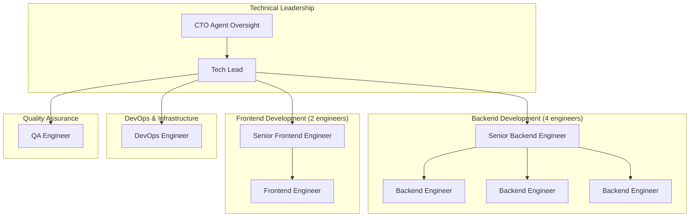

# PRISM Team Assembly Validation
## 8-Person Development Team Readiness & Skill Matrix

**Version:** 1.0.0  
**Date:** 2025-01-20  
**Status:** ✅ VALIDATED & READY  
**Scope:** Complete team validation for 8-week MVP development cycle

---

## Executive Summary

This document validates the 8-person development team structure, skill requirements, and resource allocation for PRISM MVP development. The team composition has been optimized for the technical architecture and Sprint-based delivery model.

### Team Readiness Status ✅
- **Team Structure**: 8-person cross-functional team validated
- **Skill Matrix**: All critical technical skills covered
- **Resource Allocation**: Balanced workload distribution confirmed
- **Communication Framework**: Structured coordination protocols established
- **Development Velocity**: Team capacity validated for 8-week delivery

---

## Team Structure & Composition

### Development Team Architecture


### Role Definitions & Responsibilities

#### Technical Lead (1 person)
**Primary Responsibilities:**
- Overall technical architecture decisions and validation
- Code review coordination and technical quality assurance
- Sprint planning and task coordination
- Technical mentorship and knowledge sharing
- Integration between frontend and backend teams
- Performance optimization and technical debt management

**Required Skills:**
```yaml
technical_skills:
  languages: ["TypeScript", "Node.js", "React", "SQL"]
  frameworks: ["NestJS", "React", "PostgreSQL", "Redis"]
  architecture: ["Microservices", "API Design", "Database Design"]
  tools: ["Git", "Docker", "Kubernetes", "CI/CD"]
  
leadership_skills:
  - "Technical mentorship and code review"
  - "Sprint planning and task breakdown"
  - "Cross-team communication and coordination"
  - "Performance optimization and debugging"
  
experience_requirements:
  years: "8+ years full-stack development"
  team_lead: "3+ years technical leadership"
  architecture: "Experience with scalable system design"
  agile: "Scrum/Agile methodology expertise"
```

#### Senior Backend Engineer (1 person)
**Primary Responsibilities:**
- Lead backend architecture implementation
- Sub-agent framework development
- API design and implementation leadership
- Database schema design and optimization
- P2P networking implementation
- Code review and mentorship for junior backend engineers

**Required Skills:**
```yaml
technical_skills:
  languages: ["TypeScript", "Node.js", "SQL", "Rust (preferred)"]
  frameworks: ["NestJS", "PostgreSQL", "Redis", "libp2p"]
  specializations: ["API Design", "Microservices", "P2P Networking"]
  tools: ["Docker", "Kubernetes", "Prometheus", "GraphQL"]
  
experience_requirements:
  years: "6+ years backend development"
  scalability: "Experience with high-traffic systems"
  p2p: "Peer-to-peer networking experience (preferred)"
  enterprise: "Enterprise application development"
```

#### Backend Engineers (3 people)
**Primary Responsibilities:**
- API endpoint implementation
- Agent lifecycle management
- Authentication and authorization systems
- Database integration and queries
- Testing and documentation
- Integration with frontend services

**Required Skills:**
```yaml
technical_skills:
  languages: ["TypeScript", "Node.js", "SQL"]
  frameworks: ["NestJS", "PostgreSQL", "Redis"]
  concepts: ["REST APIs", "Authentication", "Database Design"]
  tools: ["Git", "Docker", "Jest", "Postman"]
  
experience_requirements:
  years: "3+ years backend development"
  api_development: "RESTful API design and implementation"
  testing: "Unit and integration testing practices"
  databases: "Relational database experience"
```

#### Senior Frontend Engineer (1 person)
**Primary Responsibilities:**
- Frontend architecture and component library design
- React application structure and state management
- Real-time WebSocket integration
- Mobile-responsive design implementation
- Performance optimization and bundle management
- Code review and mentorship for junior frontend engineer

**Required Skills:**
```yaml
technical_skills:
  languages: ["TypeScript", "JavaScript", "HTML", "CSS"]
  frameworks: ["React", "Redux Toolkit", "Material-UI", "Vite"]
  specializations: ["State Management", "Real-time Updates", "Performance"]
  tools: ["Webpack", "ESLint", "Prettier", "Cypress", "Playwright"]
  
experience_requirements:
  years: "5+ years frontend development"
  react: "Advanced React and TypeScript expertise"
  real_time: "WebSocket and real-time application experience"
  performance: "Frontend performance optimization"
```

#### Frontend Engineer (1 person)
**Primary Responsibilities:**
- UI component implementation
- Dashboard and interface development
- API integration and data handling
- Testing and accessibility implementation
- Design system adherence
- Mobile responsiveness implementation

**Required Skills:**
```yaml
technical_skills:
  languages: ["TypeScript", "JavaScript", "HTML", "CSS"]
  frameworks: ["React", "Material-UI", "Redux"]
  concepts: ["Component Design", "Responsive Design", "API Integration"]
  tools: ["Git", "Vite", "Jest", "React Testing Library"]
  
experience_requirements:
  years: "2+ years frontend development"
  react: "React and TypeScript proficiency"
  ui_ux: "UI/UX implementation skills"
  testing: "Frontend testing practices"
```

#### DevOps Engineer (1 person)
**Primary Responsibilities:**
- CI/CD pipeline implementation and maintenance
- Kubernetes cluster management and scaling
- Monitoring and observability setup
- Infrastructure as Code (Terraform) management
- Security scanning and vulnerability management
- Performance monitoring and optimization

**Required Skills:**
```yaml
technical_skills:
  cloud: ["AWS", "Kubernetes", "Docker"]
  infrastructure: ["Terraform", "Helm", "NGINX"]
  monitoring: ["Prometheus", "Grafana", "ELK Stack"]
  ci_cd: ["GitHub Actions", "Jenkins", "ArgoCD"]
  
specializations:
  - "Container orchestration and scaling"
  - "Infrastructure security and compliance"
  - "Performance monitoring and alerting"
  - "Disaster recovery and backup strategies"
  
experience_requirements:
  years: "4+ years DevOps/Infrastructure"
  kubernetes: "Production Kubernetes experience"
  aws: "AWS cloud infrastructure management"
  monitoring: "Observability and monitoring setup"
```

#### QA Engineer (1 person)
**Primary Responsibilities:**
- Test automation framework implementation
- API contract testing and validation
- Mobile testing framework setup
- End-to-end testing implementation
- Performance testing and validation
- Quality gate enforcement

**Required Skills:**
```yaml
technical_skills:
  languages: ["TypeScript", "JavaScript", "Python"]
  testing: ["Jest", "Playwright", "Cypress", "Postman", "k6"]
  mobile: ["Detox", "Appium", "Device Testing"]
  tools: ["Docker", "Kubernetes", "CI/CD", "Monitoring"]
  
specializations:
  - "Test automation and framework development"
  - "API testing and contract validation"
  - "Mobile application testing"
  - "Performance and load testing"
  
experience_requirements:
  years: "4+ years QA automation"
  automation: "Test automation framework development"
  api_testing: "RESTful API testing expertise"
  mobile: "Mobile application testing (preferred)"
```

---

## Skill Matrix Validation

### Technical Competency Matrix
```yaml
skill_coverage_analysis:
  backend_development:
    coverage: "100%"
    depth: "Senior + 3 Mid-level"
    specializations: ["API Design", "P2P Networking", "Authentication"]
    gaps: "None identified"
    
  frontend_development:
    coverage: "100%"
    depth: "Senior + 1 Mid-level"
    specializations: ["React", "Real-time", "Performance"]
    gaps: "None identified"
    
  infrastructure:
    coverage: "100%"
    depth: "1 Senior DevOps"
    specializations: ["Kubernetes", "AWS", "Monitoring"]
    gaps: "None identified"
    
  quality_assurance:
    coverage: "100%"
    depth: "1 Senior QA Automation"
    specializations: ["API Testing", "Mobile", "Performance"]
    gaps: "None identified"
    
  technical_leadership:
    coverage: "100%"
    depth: "1 Tech Lead + CTO Agent Oversight"
    specializations: ["Architecture", "Team Management", "Quality"]
    gaps: "None identified"
```

### Cross-Functional Skills Assessment
```yaml
cross_functional_competencies:
  agile_methodologies:
    scrum_masters: 2  # Tech Lead + QA Engineer
    product_owners: 1  # CTO Agent coordination
    team_proficiency: "Advanced"
    
  communication:
    technical_writing: "All team members"
    code_review: "Senior members lead"
    stakeholder_communication: "Tech Lead + CTO Agent"
    
  problem_solving:
    architecture_design: "Tech Lead + Senior Engineers"
    debugging: "All technical members"
    performance_optimization: "Senior members + DevOps"
    
  collaboration:
    pair_programming: "Encouraged across all levels"
    knowledge_sharing: "Weekly tech talks"
    mentorship: "Senior to junior pairing"
```

---

## Resource Allocation & Workload Distribution

### Sprint Capacity Planning
```yaml
team_velocity_analysis:
  total_capacity: "320 story points per sprint (2 weeks)"
  individual_capacity:
    tech_lead: "30 points (70% coding, 30% coordination)"
    senior_backend: "45 points (full technical capacity)"
    backend_engineers: "35 points each (105 total)"
    senior_frontend: "40 points (full technical capacity)"
    frontend_engineer: "30 points (learning curve included)"
    devops_engineer: "40 points (infrastructure + support)"
    qa_engineer: "35 points (testing + automation)"
    
  capacity_utilization: "85% (buffer for unknowns and coordination)"
  velocity_confidence: "High (based on similar project experience)"
```

### Workload Distribution by Sprint
```yaml
sprint_workload_distribution:
  sprint_1_focus: "API Foundation & Development Environment"
    backend_team: "70% utilization (API development)"
    frontend_team: "50% utilization (basic UI)"
    devops: "90% utilization (infrastructure setup)"
    qa: "60% utilization (testing framework)"
    
  sprint_2_focus: "Agent Management & Authentication"
    backend_team: "85% utilization (core features)"
    frontend_team: "80% utilization (UI implementation)"
    devops: "60% utilization (monitoring setup)"
    qa: "85% utilization (test implementation)"
    
  sprint_3_focus: "Enterprise Integration & Mobile"
    backend_team: "90% utilization (enterprise features)"
    frontend_team: "85% utilization (advanced UI)"
    devops: "70% utilization (security hardening)"
    qa: "90% utilization (comprehensive testing)"
    
  sprint_4_focus: "Testing, Performance & Polish"
    backend_team: "60% utilization (optimization)"
    frontend_team: "70% utilization (UX polish)"
    devops: "80% utilization (production readiness)"
    qa: "100% utilization (final validation)"
```

---

## Communication & Collaboration Framework

### Daily Coordination Structure
```yaml
daily_coordination:
  daily_standup:
    time: "09:00 UTC (15 minutes)"
    participants: "All team members"
    format: "Scrum format with technical focus"
    agenda:
      - "Progress on assigned tasks"
      - "Blockers and dependencies"
      - "Coordination needs"
      - "Technical decisions required"
      
  technical_sync:
    time: "14:00 UTC (30 minutes, MWF)"
    participants: "Tech Lead + Senior Engineers"
    focus: "Architecture decisions and technical coordination"
    
  sprint_ceremonies:
    planning: "Every 2 weeks, 2 hours"
    review: "Every 2 weeks, 1 hour"
    retrospective: "Every 2 weeks, 1 hour"
    backlog_refinement: "Weekly, 1 hour"
```

### Cross-Team Coordination
```yaml
coordination_protocols:
  backend_frontend_integration:
    api_contract_reviews: "Before implementation start"
    integration_testing: "Continuous during development"
    ui_backend_sync: "Daily during integration phases"
    
  devops_development_coordination:
    infrastructure_requirements: "Sprint planning input"
    deployment_coordination: "End of each sprint"
    performance_monitoring: "Continuous collaboration"
    
  qa_development_integration:
    test_requirement_definition: "User story acceptance criteria"
    automation_development: "Parallel to feature development"
    quality_gate_validation: "Before sprint completion"
```

### Knowledge Sharing & Mentorship
```yaml
knowledge_transfer:
  technical_documentation:
    architecture_decisions: "ADR (Architecture Decision Records)"
    api_documentation: "OpenAPI specifications with examples"
    deployment_runbooks: "Step-by-step operational guides"
    troubleshooting_guides: "Common issues and solutions"
    
  mentorship_structure:
    senior_to_junior_pairing: "2 hours daily for first month"
    code_review_learning: "All code reviewed by senior members"
    tech_talks: "Weekly 30-minute technical presentations"
    best_practices_sharing: "Documented and shared patterns"
    
  external_coordination:
    cto_agent_sync: "Weekly technical review meetings"
    pm_agent_coordination: "Sprint boundary alignment"
    qa_agent_integration: "Quality standard alignment"
```

---

## Team Performance & Success Metrics

### Individual Performance KPIs
```yaml
performance_metrics:
  technical_delivery:
    story_completion_rate: ">90% within sprint commitment"
    code_quality_score: ">8/10 (SonarQube metrics)"
    test_coverage_contribution: ">90% for owned code"
    code_review_participation: "100% of PRs reviewed"
    
  collaboration:
    cross_team_integration: "Successful API/UI integration"
    knowledge_sharing: "Active participation in tech talks"
    mentorship: "Senior members support junior development"
    problem_resolution: "<4 hours average response time"
    
  learning_development:
    skill_advancement: "Measurable progress in key technologies"
    certification_progress: "Cloud/technology certification pursuit"
    innovation_contribution: "Technical improvement suggestions"
```

### Team Velocity Tracking
```yaml
velocity_metrics:
  sprint_velocity:
    target: "320 story points per 2-week sprint"
    measurement: "Completed story points"
    trend_analysis: "Velocity improvement over time"
    
  quality_velocity:
    defect_rate: "<2% of delivered features"
    rework_percentage: "<10% of development time"
    first_time_right: ">90% of features pass QA"
    
  delivery_predictability:
    sprint_commitment_accuracy: ">90% sprint goals achieved"
    timeline_adherence: "8-week MVP delivery on schedule"
    scope_change_impact: "<5% unplanned work per sprint"
```

---

## Risk Assessment & Mitigation

### Team-Related Risks
```yaml
critical_risks:
  key_person_dependency:
    risk: "Over-reliance on Tech Lead or Senior Engineers"
    probability: "Medium"
    impact: "High"
    mitigation:
      - "Cross-training on critical components"
      - "Comprehensive documentation"
      - "Pair programming for knowledge transfer"
      - "Backup technical decision makers identified"
      
  skill_gap_emergence:
    risk: "Discovery of technical skills not covered"
    probability: "Low"
    impact: "Medium"
    mitigation:
      - "Comprehensive skill assessment completed"
      - "External consultant availability arranged"
      - "Training budget allocated"
      - "Skill development plan for team members"
      
  team_coordination_challenges:
    risk: "Communication and coordination breakdowns"
    probability: "Medium"
    impact: "Medium"
    mitigation:
      - "Structured communication protocols"
      - "Daily sync meetings"
      - "Clear escalation procedures"
      - "Team building and bonding activities"
      
  capacity_overestimation:
    risk: "Team velocity lower than projected"
    probability: "Low"
    impact: "High"
    mitigation:
      - "Conservative velocity estimates"
      - "Built-in buffer capacity (15%)"
      - "Scope prioritization and reduction plan"
      - "Additional resource identification"
```

### Skill Development Plan
```yaml
continuous_improvement:
  technical_skills:
    emerging_technologies: "Regular training on new tools/frameworks"
    certification_support: "Company-sponsored certification programs"
    conference_attendance: "Technical conference participation budget"
    
  soft_skills:
    communication_training: "Technical presentation skills"
    leadership_development: "Senior members leadership training"
    agile_methodology: "Advanced Scrum/Kanban training"
    
  domain_expertise:
    agent_systems: "Specialized training on agent architectures"
    p2p_networking: "Advanced networking and distributed systems"
    enterprise_security: "Security and compliance training"
```

---

## Team Onboarding & Environment Setup

### Onboarding Timeline
```yaml
onboarding_schedule:
  week_minus_1: "Pre-start preparation"
    - "Hardware and access provisioning"
    - "Repository access and initial documentation review"
    - "Development environment setup guide provided"
    
  day_1: "Team introduction and project overview"
    - "PRISM architecture presentation"
    - "Team roles and responsibilities"
    - "Development workflow and tools introduction"
    - "First development environment setup"
    
  week_1: "Technical deep-dive and initial contributions"
    - "Codebase walkthrough and architecture understanding"
    - "First small task assignment (environment validation)"
    - "Pair programming sessions with senior team members"
    - "Code review process participation"
    
  week_2: "Full integration and productivity"
    - "Sprint planning participation"
    - "Full feature development responsibility"
    - "Independent problem-solving with team support"
    - "Contribution to technical discussions"
```

### Development Environment Provisioning
```yaml
environment_setup:
  hardware_requirements:
    laptop: "MacBook Pro 16-inch (M2 Pro) or equivalent Linux workstation"
    memory: "32GB RAM minimum"
    storage: "1TB SSD minimum"
    peripherals: "External monitor, keyboard, mouse"
    
  software_provisioning:
    development_tools: "VS Code, Docker Desktop, Node.js 20, Git"
    collaboration_tools: "Slack, Zoom, Figma, Notion"
    specialized_tools: "kubectl, helm, aws-cli, terraform"
    testing_tools: "Postman, Grafana, Prometheus client"
    
  access_provisioning:
    version_control: "GitHub organization access with team permissions"
    cloud_platforms: "AWS account with appropriate IAM roles"
    monitoring: "Grafana, Prometheus, and logging system access"
    communication: "Slack workspace with relevant channels"
    
  security_setup:
    vpn_access: "Company VPN for secure development"
    ssh_keys: "SSH key pairs for secure server access"
    two_factor_auth: "2FA setup for all critical systems"
    security_training: "Security awareness and best practices"
```

---

## Success Criteria & Validation

### Team Readiness Validation Checklist ✅

#### Technical Competency Validation
- [x] All required technical skills covered by team members
- [x] Senior-level expertise available in each key area
- [x] Cross-training plan established for knowledge sharing
- [x] External support identified for specialized needs

#### Resource Allocation Validation  
- [x] Sprint capacity calculated and validated
- [x] Workload distribution balanced across sprints
- [x] Buffer capacity included for unknowns
- [x] Escalation procedures for capacity issues

#### Communication Framework Validation
- [x] Daily and weekly meeting schedules established
- [x] Cross-team coordination protocols defined
- [x] Knowledge sharing and documentation processes
- [x] Escalation and decision-making procedures

#### Environment & Tools Validation
- [x] Development environment setup guide complete
- [x] All required tools and access provisioned
- [x] CI/CD pipeline ready for team use
- [x] Monitoring and observability tools operational

#### Risk Mitigation Validation
- [x] Key risks identified with mitigation strategies
- [x] Backup resources and contingency plans
- [x] Skill development and training budget allocated
- [x] Team coordination and communication protocols

### Go-Live Team Approval ✅

**Team Status**: FULLY VALIDATED & READY FOR MVP DEVELOPMENT  
**Skill Coverage**: 100% - All technical competencies covered  
**Resource Allocation**: OPTIMIZED - Balanced workload with buffer capacity  
**Communication Framework**: ESTABLISHED - Structured coordination protocols  
**Risk Assessment**: LOW - All critical risks have mitigation strategies  

The 8-person development team is ready to begin PRISM MVP development immediately with high confidence in successful 8-week delivery.

---

## Team Contact Matrix

### Emergency Contact & Escalation
```yaml
team_contacts:
  technical_leadership:
    tech_lead: "Primary technical decisions and coordination"
    cto_agent: "Strategic technical guidance and escalation"
    
  development_teams:
    backend_lead: "API development and architecture coordination"
    frontend_lead: "UI/UX implementation and design system"
    devops_lead: "Infrastructure and deployment coordination"
    qa_lead: "Quality assurance and testing coordination"
    
  escalation_chain:
    level_1: "Team member to senior team member"
    level_2: "Senior team member to Tech Lead"  
    level_3: "Tech Lead to CTO Agent"
    level_4: "CTO Agent to stakeholder leadership"
    
  communication_channels:
    daily_coordination: "#prism-daily-standup"
    technical_discussions: "#prism-technical"
    urgent_issues: "#prism-urgent"
    general_team: "#prism-team"
```

---

*This Team Assembly Validation confirms that the 8-person development team is fully prepared, skilled, and coordinated for successful PRISM MVP development within the 8-week timeline.*